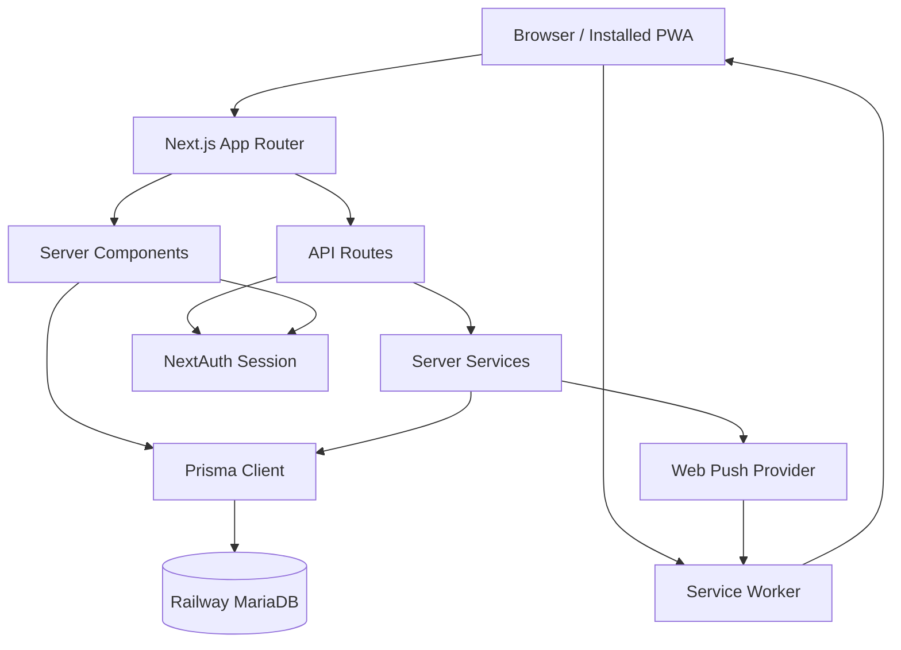

# TaskManager Architecture

**Status:** Living Document  
**Last Updated:** 2026-07-18
**Last Verified Against Commit:** `7049fbc`
**Repository Branch:** `main`  
**Working Tree Note:** This document also reflects pending documentation changes that are not represented by the verification commit.  
**Purpose:** Authoritative technical architecture reference for TaskManager. This document explains how the application is currently structured, how its major modules interact, and why key architectural decisions exist. It is intended for maintainers and future AI-assisted development sessions before significant technical changes are made.

**Audience:**

- Future maintainers
- AI coding assistants
- Contributors

## System Overview

TaskManager is a Next.js application for task tracking, delegated work, lightweight collaboration, time logging, reporting, and notifications. It is organised around user-owned profiles, project/task workflows, shared delegated tasks, collaborative spaces, and a central notification system with in-app and Browser Push delivery.

The architecture serves practical daily work rather than enterprise process modelling. Its main goals are clear ownership boundaries, low-friction task capture, visible work state, reliable notification delivery, and safe multi-user collaboration.

Core concepts include profiles as work contexts, tasks and projects as the primary planning model, delegated tasks as shared participant workflows, groups as user-visibility boundaries, and notifications as centralised domain events with multiple delivery channels.

## High-Level Architecture

TaskManager is a full-stack Next.js App Router application backed by Prisma and MariaDB. Most feature logic is implemented in server routes, server components, shared server-side services, and client components for interactive workflows.

Major layers:

- **Next.js application:** App Router pages, layouts, server components, client components, and API routes under `app/`.
- **Prisma:** Typed data access and migrations, with MariaDB as the configured provider.
- **MariaDB:** Production database hosted on Railway.
- **Authentication:** NextAuth credentials provider with JWT sessions.
- **API routes:** Authenticated JSON endpoints for tasks, projects, profiles, delegation, spaces, notifications, push subscriptions, timesheets, users, and check-ins.
- **Notification flow:** Central dispatcher creates in-app rows and triggers Web Push delivery when preferences allow it.
- **Browser Push:** `web-push` server library sends to stored subscriptions.
- **Service Worker:** Root-scoped `/sw.js` handles push display, active-tab suppression, badge updates, and notification clicks.
- **PWA:** Manifest and installed-app metadata enable standalone usage, including iPhone Home Screen push subscriptions.

## Architectural Principles

TaskManager favours server-side enforcement over client trust. Client components can improve ergonomics, but authentication, ownership, group visibility, delegated task permissions, and notification recipient checks must be enforced by server routes and shared server-side helpers.

Each domain concept should have a clear source of truth. Notification events flow through the dispatcher instead of separate in-app and Push systems. Database shape is defined by Prisma schema and migrations, not ad hoc production changes. Delegated tasks remain shared lifecycle records rather than disconnected task copies.

Shared services are preferred when behavior crosses routes or UI surfaces. New work should extend existing helpers, dispatchers, settings pages, and workflow components before introducing parallel implementations. Duplication is acceptable only when the abstraction would be weaker than the repeated code.

The codebase should evolve incrementally. Prefer focused migrations, small route/service changes, and compatibility-preserving UI improvements over large rewrites. Preserve backwards compatibility where practical, especially for existing data, notification preferences, delegated task state, and migration history.

Simplicity comes before abstraction. Add an abstraction when it removes real complexity, centralises a rule that must stay consistent, or matches an established local pattern. Avoid introducing queues, background systems, generic configuration layers, or new module boundaries before the measured need exists.

### Date and Time Rendering

Initial server and client output must be deterministic. User-facing calendar dates use `en-AU`; timestamps representing an instant use `Australia/Brisbane` with an explicit hour cycle. Parse `YYYY-MM-DD` values as calendar dates rather than UTC timestamps, and supply the current time explicitly across server/client boundaries instead of reading it independently during both initial renders. Shared helpers for these rules live in `app/lib/date-time.ts`.

Database evolution is migration-first. Shared Railway databases must not be changed with `prisma db push`, reset operations, or undocumented migration-ledger edits. Documentation evolves with the codebase: significant architectural changes require this document to be reviewed, even when the result is "reviewed, no update required."

## Core Modules

### Profiles

Profiles are user-owned work contexts. They group tasks, projects, time entries, Sunday check-ins, and profile-level display preferences.

Responsibilities:

- Provide separate task spaces for a single user.
- Store default view and reporting preferences.
- Enable profile-specific routine support.
- Scope task, project, and timesheet ownership.

Relationships:

- A `User` owns many `Profile` records.
- A `Profile` owns tasks, projects, time entries, and Sunday check-ins.

### Overview

Overview is the cross-profile operational workspace. It aggregates the user's profile tasks and projects into a broader planning view.

Responsibilities:

- Surface tasks and projects across profiles.
- Support filtering, sorting, priority visibility, and context actions.
- Provide navigation into profile-specific task views.

Relationships:

- Reads from profile-owned tasks and projects.
- Respects the authenticated user's profile ownership.

### Tasks

Tasks are the core work item. They support due dates, start dates, completion, priority, category, notes, waiting-on metadata, ordering, recurrence, recurrence pauses, project grouping, and delegation.

Responsibilities:

- Represent actionable work.
- Support profile day/week/month planning.
- Track completion and reopening.
- Support recurring task generation and pause behavior.
- Serve as the underlying work item for delegated tasks.

Relationships:

- A task may belong to a profile.
- A task may belong to a project.
- A task may have many note-history entries.
- A task may have one delegated task wrapper.

### Projects

Projects group tasks within a profile and provide higher-level organisation.

Responsibilities:

- Group related tasks.
- Track project due dates, category, priority, archived/collapsed state, and ordering.
- Support profile task views and Overview workflows.

Relationships:

- A project belongs to one profile.
- A project has many tasks.

### Delegated Tasks

Delegated tasks coordinate work between two users: the delegator and the assignee.

Responsibilities:

- Create or wrap a task as delegated work.
- Track lifecycle state: pending, accepted, in progress, completed, closed, declined.
- Enforce participant-only actions.
- Generate delegated task notifications.
- Preserve shared notes and state transitions.

Relationships:

- A delegated task references one task.
- It references an assigned-by user and assigned-to user.
- Delegated notification target URLs route to Assigned To Me or Assigned By Me.

### Notifications

Notifications are centralised records and delivery events for user-facing updates.

Responsibilities:

- Store in-app notifications.
- Maintain unread/read/cleared state.
- Apply per-type notification preferences.
- Dispatch Web Push as a delivery channel.
- Provide notification center data and unread counts.

Relationships:

- A notification belongs to a recipient user.
- It may reference an actor user.
- Delegated task events are currently the primary notification source.

### Push Notifications

Push notifications are a delivery channel attached to the existing notification dispatcher, not a separate event system.

Responsibilities:

- Store multiple browser/device subscriptions per user.
- Respect global and per-type push preferences.
- Send Web Push through the server-side `web-push` library.
- Clean up expired subscriptions.
- Update send-time badge counts.
- Route notification clicks back into TaskManager.

Relationships:

- Uses `PushSubscription`, `NotificationPreference`, and `User.notificationPushEnabled`.
- Uses notification dispatcher payloads and existing delegated task target URLs.
- Uses `/sw.js` for push display and click handling.

### Timesheets

Timesheets track time entries by profile and week.

Responsibilities:

- Record manual and timer-sourced time entries.
- Support week navigation and current-week workflows.
- Feed reporting views.

Relationships:

- A time entry belongs to a profile.
- Time reports aggregate time entries across selected scopes.

### Reports

Reports summarise productivity, time, efficiency, activity, and profile-level work.

Responsibilities:

- Aggregate tasks, projects, time entries, activity logs, and check-in data.
- Provide user-facing and admin-facing reporting views.
- Support operational review rather than raw database inspection.

Relationships:

- Reads from profile-owned work for normal users.
- Admin reports may read broader activity data.

### Activity Log

Activity logs record notable user and system actions for audit and reporting.

Responsibilities:

- Capture task, project, profile, timesheet, space, and user activity.
- Support admin user activity reports and operational inspection.

Relationships:

- Activity records may reference users, profiles, tasks, projects, time entries, and spaces.

### Collaborative Spaces

Collaborative spaces provide shared matrix-style work areas with members, rows, columns, status options, cells, and cell notes.

"Collaborative Spaces" is the formal subsystem name; "Spaces" is the shorter label used in application navigation and routes.

Responsibilities:

- Support structured collaborative tracking outside profile task lists.
- Enforce space membership and owner permissions.
- Support column types, row state, cell updates, comments, and print views.

Relationships:

- A collaborative space has members.
- A space has matrix rows and columns.
- Cells connect rows and columns and may reference users or notes.

### Groups

Groups define user visibility boundaries.

Responsibilities:

- Control which users non-admin users can see or select.
- Scope delegated task recipient selection.
- Scope collaborative space member selection.

Relationships:

- Users join groups through membership records.
- Admin users can see all users.
- Non-admin users generally see themselves plus users sharing a group.

### Sunday Check-ins

Sunday Check-ins are profile-specific weekly reflection records. The current implementation supports a specialised Evie routine-support workflow rather than a general check-in platform for every user.

Responsibilities:

- Store selected check-in options and reflection text.
- Support the current routine-support profile workflow.
- Respect a fixed weekly cadence with Sunday-oriented availability and naming.
- Feed admin/user activity reporting.

Relationships:

- A check-in belongs to one profile and one week start.
- Availability depends on the profile's `routineSupportEnabled` flag.
- The current selectable options and summary are purpose-built for the routine-support workflow.

### Routine Support

Routine support is a profile-level feature for recurring personal support workflows.

Responsibilities:

- Mark profiles that participate in routine support.
- Summarise routine-related tasks and check-ins.
- Support routine reporting and streak-style operational insight.

Relationships:

- Uses profile flags, recurring tasks, routine-named projects, and Sunday Check-ins.
- It is not currently a broadly configurable feature that every user enables for themselves by default.

## Data Model Overview

The current Prisma schema is the source of truth. This section summarises the architecture rather than repeating the schema.

Major entities:

- **User:** Authenticated account. Owns profiles, group memberships, space memberships, notifications, notification preferences, push subscriptions, task notes, and delegated task relationships.
- **Profile:** User-owned workspace. Owns tasks, projects, time entries, and Sunday check-ins.
- **Task:** Work item. May belong to a profile and project. May be recurring. May be wrapped by a delegated task. Has note history.
- **Project:** Profile-scoped grouping for tasks.
- **DelegatedTask:** Lifecycle wrapper around a task, with assigned-by and assigned-to user references.
- **TaskNote:** Historical note/waiting-on entries attached to tasks.
- **Notification:** In-app notification row with recipient, optional actor, type, target URL, metadata, event key, read state, and cleared state.
- **NotificationPreference:** Per-user, per-notification-type in-app and push settings.
- **PushSubscription:** Per-device browser push subscription for a user. Uses a unique endpoint hash rather than indexing the full endpoint.
- **Group / UserGroup:** User visibility model.
- **CollaborativeSpace / SpaceMember / Matrix models:** Collaborative matrix workspace.
- **TimeEntry:** Profile-owned time tracking entry.
- **ActivityLog:** Auditable action log.
- **SundayCheckIn:** Weekly profile check-in record used by the specialised routine-support workflow.

Ownership model:

- Profile-owned resources are normally accessed through the authenticated user's profiles.
- Delegated tasks are accessible to their participants.
- Collaborative spaces are accessible to members.
- User discovery is constrained by group visibility unless the user is an admin.

Important constraints:

- Notification `eventKey` is unique to prevent duplicate in-app rows.
- Notification preferences are unique by user and notification type.
- Push subscriptions are unique by endpoint hash.
- Delegated task has a unique task relationship.
- Sunday check-ins are unique by profile and week start.
- Recurring tasks have constraints around profile, recurrence series, and start date.

## Notification Architecture

The notification system is implemented as one central domain notification pipeline with multiple delivery channels.

### Dispatcher

The dispatcher lives in the server-side notification service. Callers provide:

- recipient user id
- actor user id when applicable
- notification type
- title/body
- target URL
- metadata
- deterministic event key

The dispatcher evaluates in-app preferences, creates an in-app `Notification` row when enabled, and calls the push delivery service. Web Push delivery is currently awaited during notification dispatch, but failures are caught and do not roll back the delegated task action or the in-app notification flow. TaskManager does not currently use a queue, worker, cron job, or transactional outbox for push delivery.

This keeps event mapping centralised and avoids separate notification systems for in-app and push.

### In-App Notifications

In-app notifications are stored in the database. The notification center reads recent rows, shows unread counts, marks individual or all rows read, and clears individual or all rows by archiving them with `clearedAt`.

Unread counts are exposed through an authenticated API and are used by:

- notification bell badge
- notification panel
- browser title badge
- dynamic favicon badge
- app badge where supported

### Preferences

Preferences are split into:

- `NotificationPreference.inAppEnabled`
- `NotificationPreference.pushEnabled`
- `User.notificationPushEnabled`

Missing preference rows behave as:

- in-app enabled
- push disabled

This preserves existing in-app behavior while keeping push opt-in.

### Browser Push

Push delivery uses stored `PushSubscription` records and server-side VAPID configuration. A user may have multiple subscriptions for different browsers, devices, or installed app instances.

Push is sent only when:

- global push is enabled for the user
- per-type push is enabled
- at least one active subscription exists
- VAPID configuration is present and valid

Delivery is best-effort per subscription. One device failure does not block other devices or roll back the domain action.

### PWA And Service Worker

TaskManager has a web app manifest and a root-scoped service worker at `/sw.js`.

The service worker:

- receives push payloads
- updates app badge count where supported
- suppresses duplicate browser notifications when TaskManager is focused and visible
- shows browser notifications when the app is closed, backgrounded, hidden, or minimised
- handles notification clicks
- focuses or opens a TaskManager window
- rejects unsafe external click URLs

### Deep-Link Routing

Push and in-app notifications use the same target URLs. Current delegated notification destinations are existing list routes:

- assignee-facing events: `/delegated/assigned-to-me`
- delegator-facing events: `/delegated/assigned-by-me`

The delegated task id is stored in notification metadata and contributes to deterministic event keys, but it is not currently used by the delegated pages to select, scroll to, highlight, or open an individual task. TaskManager does not currently have a standalone delegated-task detail route or notification-specific modal/detail view.

Notification clicks therefore open the correct Assigned To Me or Assigned By Me list. The relevant delegated task is visible within that list alongside the user's other delegated tasks, subject to the page's normal open/closed filtering, ordering, and pagination.

If the user's authentication session has expired, normal route authentication behavior applies and the user must sign in before reaching the destination.

### Active-Tab Suppression

When a push arrives while a same-origin TaskManager client is focused and visible, the service worker does not show a duplicate browser notification. It sends a message to the open page so the in-app notification center and badge state can refresh.

This preserves the in-app notification center as the active-session experience while keeping browser/mobile notifications for background or closed app states.

### Badge Updates

The current badge model is intentionally lightweight:

- unread count is polled and refreshed by the notification center
- browser title is prefixed with the unread count
- favicon badge is generated dynamically where supported
- service worker push payload includes send-time `badgeCount`
- installed app badge is updated where the Badging API exists

Full real-time badge synchronisation across every read/clear event and every installed platform is not currently implemented.

### Expired Push Cleanup

When the push provider returns a permanent expiration status such as `404` or `410`, only the matching subscription is deleted. Temporary failures are logged and retained for future attempts.

## Security Architecture

TaskManager uses server-side enforcement as the primary security boundary.

### Authentication

Authentication uses NextAuth with credentials login and JWT sessions. API routes and server-rendered pages read the authenticated session server-side.

### Authorisation

Authorisation is enforced by route handlers and server-side helper functions. The main patterns are:

- profile resources require ownership by the authenticated user
- delegated task actions require sender or recipient participation depending on action
- collaborative spaces require space membership or ownership
- visible user lists are filtered through group visibility
- admin-only routes check the user's admin role

### Group Visibility

Groups define which users can see or select other users. Non-admin users are limited to themselves and users sharing a group. Admin users can see all users.

This affects delegated task recipient selection and collaborative space member selection.

### Delegated Task Permissions

Delegated task permissions are lifecycle-specific:

- assignee accepts, declines, starts, completes, and adds notes
- delegator closes completed work and adds notes
- both participants can view their respective delegated task lists
- note notifications are sent to the other participant only

### Feature Restrictions

Feature access is enforced server-side. The restricted Lost/Hatch feature is an example: access is gated by server-side email checks rather than client-side hiding alone.

## Database Strategy

TaskManager uses Prisma with MariaDB hosted on Railway.

### Prisma And MariaDB

The configured datasource provider is MySQL/MariaDB. Prisma Client is the application's primary database access layer.

The schema uses `relationMode = "prisma"`. This means Prisma models relationships at the application layer rather than relying on database-enforced foreign keys. This choice reflects legacy database compatibility constraints and reduces reliance on database engine behavior that has varied historically.

### Legacy Compatibility

The repository includes migration history from earlier development stages. Some legacy schema changes were previously applied outside Prisma's normal migration ledger and later reconciled after a migration-history audit.

Compatibility code should be removed only when the live schema and deployment history are verified to support removal.

### Migration Strategy

Schema evolution must use Prisma migrations. The repository explicitly prohibits `prisma db push` against the shared Railway database because it can alter live schema without creating or recording migrations.

Required workflow:

1. Update `prisma/schema.prisma`.
2. Create a named migration.
3. Review generated SQL.
4. Commit schema, migration, application code, and docs together.
5. Apply with `npx prisma migrate deploy`.
6. Confirm with `npx prisma migrate status`.
7. Run Prisma generation and project checks.

Manual migration-ledger reconciliation must be documented.

### Backup And Operational Cautions

Railway database backups and operational discipline are part of the production safety model. Destructive operations such as reset, migration deletion, or direct ledger edits must not be used on production data.

## Deployment Architecture

### Local Development

Local development runs the Next.js app with `npm run dev`. The application expects environment variables for database, authentication, and push configuration.

### Railway

Railway hosts the MariaDB database. `DATABASE_URL` points Prisma to the configured database.

### Vercel

The application is designed for deployment as a Next.js app on Vercel-style infrastructure. Production deployments must include all required environment variables and committed Prisma migrations.

### Environment Variables

Important variables include:

- `DATABASE_URL`
- `NEXTAUTH_SECRET`
- `NEXT_PUBLIC_VAPID_PUBLIC_KEY`
- `VAPID_PRIVATE_KEY`
- `VAPID_SUBJECT`

Only the VAPID public key is exposed to browser code. The private key must remain server-only.

### Deployment Flow

The expected deployment flow is:

1. Commit application changes and migrations.
2. Apply database migrations with `npx prisma migrate deploy`.
3. Confirm migration status.
4. Generate Prisma Client.
5. Build the application locally or in the hosting pipeline.
6. Deploy through the configured Vercel-style hosting flow.
7. Perform manual verification for affected workflows.

Production database safety rules remain unchanged: do not use `prisma db push` on the shared Railway database, do not run `prisma migrate reset` against production data, do not delete committed migration history, and do not make undocumented migration-ledger edits.

## Testing Strategy

TaskManager combines automated checks with manual workflow verification.

Automated tests currently cover:

- deterministic Australian/Brisbane date and time formatting
- Brisbane date, greeting, midnight, and week-boundary behavior
- recurring task pause behavior
- push subscription validation and endpoint hashing
- push delivery preference behavior
- multiple-device push attempts
- expired subscription cleanup
- safe push target URL handling
- push payload mapping

Build verification uses `npm run build`, which also performs TypeScript checks.

Notification testing is split across automated and manual coverage:

- unit-style tests mock Web Push transport
- desktop manual tests verify browser notification behavior, active-tab suppression, title badge, favicon badge, and in-app notification center behavior
- iPhone/Home Screen manual tests verify installed app delivery and click routing
- notification settings, unread/read/clear workflows, and route-level UI behavior require manual verification unless matching automated tests are added

Deployment verification should include:

- Prisma validation
- Prisma client generation
- migration status
- production build
- smoke testing critical flows after deployment

## Known Technical Debt & Future Review

This section is the maintainable source for the active technical-debt register. The
Engineering Playbook curates it, while Security, Testing, Push, migration, and
operations documents own their detailed rules. Priorities use the following scale:

- **P0:** immediate severe risk;
- **P1:** address before further TaskManager feature work;
- **P2:** important planned cleanup;
- **P3:** acceptable to defer; and
- **Monitor only:** do not implement without evidence or a review trigger.

### Audit Baseline — 18 July 2026

The repository and configured production database were audited from clean HEAD
`7049fbc`. Checks were read-only except for normal local build output. No application
or production data changes were made.

| Check | Result |
|---|---|
| Repository minimum runtime | Node.js 22.13.0 |
| Local audit runtime | Node v25.6.1; npm 11.18.0 |
| Full lint | Failed: 47 errors and 17 warnings |
| TypeScript | Passed: `npx tsc --noEmit` |
| Automated tests | Passed: 31; failed: 0 |
| Production build | Passed |
| Prisma validation | Passed |
| Migration status | 32 migrations; configured database up to date |
| Production dependency audit | 16 vulnerabilities: 9 high and 7 moderate |
| Dependency tree | `npm ls --depth=0` passed |
| Diff hygiene | `git diff --check` passed |

The test run also emitted two non-fatal Node module-type reparsing warnings for
TypeScript modules imported by the Node test runner. They are quality noise rather
than test failures.

### Milestone 1 Status — Framework Security Upgrade

Completed and verified on 18 July 2026. `next` and `eslint-config-next` were
upgraded together from 16.1.6 to the stable 16.2.10 release. React and React DOM
remain at 19.2.3 because they satisfy the framework peer requirements; the
repository minimum remains Node.js 22.13.0.

The post-upgrade production audit still reports 16 vulnerabilities, now 8 high and
8 moderate. All direct Next.js advisories reported in the baseline audit are gone.
The remaining findings are Prisma CLI/config transitive packages (high), Next.js's
pinned PostCSS dependency (moderate), and NextAuth's UUID dependency (moderate).
They remain in the dependency/toolchain register rather than being folded into this
isolated framework milestone. Type checking, 31 tests, the production build, Prisma
validation, dependency-tree validation, targeted framework-file linting, and
minimum-runtime TypeScript/tests/build passed. Full lint remains at the unchanged
pre-existing baseline of 47 errors and 17 warnings. Safe local HTTP checks confirmed
public assets/routes and unauthenticated redirects; authenticated mutation checks
remain a deployment smoke-test responsibility because the repository has no
disposable application database.

### Milestone 2 Status — Profile and Timer Ownership

Completed and verified on 18 July 2026. Profile reorder now authenticates locally,
validates the complete submitted ID set against the authenticated owner's profiles,
and performs validation, scoped updates, and the scoped response read atomically.
Unknown, inaccessible, mixed-owner, duplicate, or incomplete sets cannot partially
change order values.

Timesheet active reads, start, and stop are scoped to the authenticated user's
profiles. One active timer is allowed per user, while separate users may run timers
simultaneously. Start and stop take a per-user database row lock; stop also uses a
conditional active-row update, so repeated or concurrent stops cannot finalise the
same timer twice. Timer completion persists the calendar date derived from the stop
instant in `Australia/Brisbane`, stored deterministically at UTC midnight, while
elapsed duration continues to use the real start and stop instants.

The suite now has 47 passing tests, including production-core regressions for
unauthenticated boundaries, owner/wrong-user cases, atomic reorder validation,
separate-user and same-user timer behavior, concurrent stop attempts, UTC-process
execution, and Brisbane midnight boundaries. These service-level tests use
transactional in-memory adapters; the repository still lacks a disposable MariaDB
route-test target, so direct route/Prisma integration and two-account browser checks
remain manual. Type checking, changed-file lint, Prisma validation, the production
build, and Node 22.13.0 tests/type checking passed. Full lint is now 38 errors and
17 warnings; the nine-error reduction comes only from removing affected-route
`any` usage in this milestone.

### Active Register

| Item | Status | Priority | Category | Evidence / audit date | Recommended action | Blocks feature work? |
|---|---|---|---|---|---|---|
| Next.js/framework security update | Completed and verified | Resolved | Resolved / retire from register | 18 July 2026: `next` and `eslint-config-next` upgraded from 16.1.6 to 16.2.10; all direct Next.js advisories cleared; required checks passed and full lint remained 47 errors/17 warnings. | Perform the outstanding authenticated deployment smoke checks before release. Track remaining transitive advisories under dependency/toolchain alignment. | No |
| Global profile reorder ownership | Completed and verified | Resolved | Resolved / retire from register | 18 July 2026: local authentication, full owned-set validation, scoped atomic mutation/response, and production-core owner/wrong-user/rollback tests added. | Retain two-account negative smoke checks and add direct route/Prisma coverage when a safe database harness exists. | No |
| Timer start/stop ownership | Completed and verified | Resolved | Resolved / retire from register | 18 July 2026: active reads/start/stop scope by authenticated owner; per-user locking and conditional completion prevent same-user races while allowing separate-user timers. | Manually smoke with two accounts; retain the one-active-timer-per-user rule. | No |
| Timer Brisbane calendar date | Completed and verified | Resolved | Resolved / retire from register | 18 July 2026: completion derives `entryDate` from the stop instant with named Brisbane timezone logic; UTC and midnight regressions pass. | No historical migration; monitor only if a persistence/reporting discrepancy is observed. | No |
| Ownership and timezone regression coverage | Focused service coverage added; route/database harness still missing | P2 | Test coverage gap | `tests/ownership-regressions.test.mjs` exercises production cores with transactional in-memory adapters; date tests run under UTC. Real Prisma/MariaDB handlers are type/build verified, not database-integrated. | Add direct route/Prisma tests when a disposable MariaDB target exists; keep two-account manual checks meanwhile. | No |
| Orphaned production records | Investigated; remediation not authorised | P2 | Data integrity | The 18 July 2026 Milestone 3 audit reproduced all seven orphan classes and found no count change, active timer, active owner/membership path, or current cross-user exposure. It also confirmed downstream Space data and historical delete evidence. | Obtain per-class human approval, back up, dry-run an assertion-gated repair, then add destructive-route integration coverage. | Before schema/relation work; not ordinary feature work |
| Push subscription endpoint hardening | Credible risk; environment controls unverified | P2 | Security gap | Subscription validation accepts arbitrary HTTP/HTTPS hosts and `web-push` later constructs an outbound HTTPS request to the stored host. | Require HTTPS and review private, loopback, link-local, unsafe-host, and egress protections; add malicious-host tests. | No |
| Repository-wide lint debt | Active | P2 | Maintainability debt | After Milestone 2 on 18 July 2026: 38 errors and 17 warnings—33 explicit `any` errors, 3 React effect/state errors, 2 JSX escaping errors, 13 unused warnings, and 4 hook-dependency warnings. The audit baseline was 47/17. | Address hook correctness first, then remaining API transaction types, then dead code/style. | No |
| Delegation, Spaces, notification, and Push route coverage | Missing/incomplete | P2 | Test coverage gap | Current tests do not exercise participant, member/owner/non-member, recipient, cursor, preference, or subscription ownership at route level. | Add focused role/ownership matrices before expanding those subsystems. | Before affected feature expansion |
| Copied production logic in tests | Active drift risk | P2 | Test coverage gap | Recurrence-pause and Push-subscription tests reimplement logic; date-time and Push-delivery tests import production modules. | Import small production helpers where practical; label any retained copies as specification examples. | No |
| CI | Missing | P2 | Test coverage gap | No repository CI configuration exists. | Add type, test, build, and lint gates after the P1 work and a deliberate lint transition. | No |
| Disposable MariaDB migration/integrity target | Missing | P2 | Operational limitation | `relationMode = "prisma"` has no physical foreign-key safety. A repeatable production count-only audit now exists, but there is no disposable migration/destructive-route target. | Define a safe disposable target and exercise cascade/set-null behavior before further relation/destructive work. | Before schema/destructive work |
| Distributed permission and task-action logic | Active | P2 | Maintainability debt | Ownership checks are repeated across profile/task/project routes, while Tracker and Overview duplicate significant task-action behavior. | Consolidate narrow domain helpers without introducing a broad generic permission framework. | Before adding similar routes/actions |
| Query and payload scaling | Evidence-based risk; no current incident | P2 | Operational limitation | Home performs one task request per profile; Overview loads all open tasks and note histories; Reports loads all historical tasks/time entries before in-memory filtering. | Add scoped summary queries, database period filtering, and pagination only where data growth or measured latency warrants it. | No |
| Unsafe admin bootstrap exposure | Completed and verified | Resolved | Resolved / retire from register | 18 July 2026: investigation confirmed a production administrator hash matched the predictable password committed in the bootstrap script. The password was manually rotated, and the obsolete bootstrap and fixed-identity email-update scripts were removed without rewriting Git history or changing production data in this milestone. Resolution covers the known password and unsafe tooling, not JWTs issued before rotation. | Never reuse the exposed credential. Track possible pre-rotation sessions under the separate lifecycle item below; design a reviewed first-admin/recovery tool only if clean-install support becomes a product requirement. | No |
| Prisma dependency alignment | Completed and verified; GitHub recalculation pending | Resolved | Resolved / retire from register | 18 July 2026: `prisma` and `@prisma/client` moved from 7.4.1 to 7.8.0, matching `@prisma/adapter-mariadb` 7.8.0. Full audit fell from 21 package findings (10 high, 10 moderate, 1 low) to 12 (2 high, 9 moderate, 1 low); the production audit fell from 16 (8 high, 8 moderate) to 7 moderate and no high findings. Tests, types, builds, generation, validation, the 32-migration status check, and the read-only 28-relation audit passed. | Let GitHub recalculate after push. Track the remaining moderate `@hono/node-server` advisory as Prisma CLI/development tooling; do not downgrade Prisma or add an override. | No |
| Remaining dependency/toolchain maintenance | Partially remediated; GitHub recalculation pending | P2 | Maintainability debt | 18 July 2026: a range-compatible lockfile refresh patched the four development alerts for `flatted` 3.4.2, `picomatch` 4.0.5, `js-yaml` 4.3.0, and `@babel/core` 7.29.7 without overrides. Full audit fell from 12 findings (2 high, 9 moderate, 1 low) to 8 moderate; production audit remained 7 moderate because npm also counts affected parent packages. Three GitHub package alerts remain upstream-pinned: Prisma CLI's `@hono/node-server` 1.19.11, Next.js's PostCSS 8.4.31, and NextAuth's UUID 8.3.2. | Let GitHub recalculate after push. Adopt supported parent-package patches when available; do not downgrade Prisma/NextAuth or override Next's exact PostCSS pin. Node types still target 20 while the supported runtime minimum is 22.13.0. | No |
| Delegated task origin semantics | Undecided | P2 | Product review trigger | Acceptance/copy behavior and older “origin should not move” philosophy are not fully aligned. | Decide the intended long-term copy/move/ownership model before adding reassignment, reopen, or expanded lifecycle features. | Before delegated lifecycle expansion |
| Account/session lifecycle and login controls | Known limitation | P3 | Security gap | JWT sessions have no per-user revocation/version mechanism; password reset does not explicitly revoke tokens, including any issued before the 18 July bootstrap-password rotation; forced and self-service password changes and application lockout/attempt audit do not exist. | Decide separately whether global invalidation is warranted for the bootstrap incident; review per-user revocation with offboarding, compromise-response, temporary-password, or self-service requirements. | No |
| Security headers and hosting controls | Needs environment confirmation | P3 | Security review trigger | No application-specific headers are declared; Vercel/WAF rate limiting and header policy were not verified by the repository audit. | Confirm deployment controls before changing repository policy. | No |
| Logging, privacy, and retention | Known limitation | P3 | Operational limitation | Logs can include internal IDs and error detail; notifications/activity records have no documented retention process. No secrets or full Push endpoints were found in application logs. | Define access and retention before external observability or material user growth. | No |
| Push-device lifecycle | Known limitation | P3 | Operational limitation | Multi-device storage and expired-provider cleanup exist; retention windows, device labels, and remove-all-device controls do not. | Revisit with device churn, shared devices, or formal offboarding. | No |
| Browser automation, coverage tooling, and staging | Deferred | P3 | Test coverage gap | No broad browser suite, coverage target, or declared staging environment exists. | Add selected stable scenarios after route/security coverage; retain real-device Push checks. | No |
| Legacy fallbacks and lint suppressions | Localised | P3 | Maintainability debt | Two temporary profile compatibility TODOs and five LOST hook-dependency suppressions remain. | Remove or review only when environment reconciliation or feature work supplies evidence. | No |

### Production Data-Integrity Evidence

Milestone 3 reran a fixed, read-only audit against Railway production at
2026-07-18T02:29Z. The database was at all 32 committed migrations and had zero
physical foreign keys. The audit returned aggregate counts and metadata only; it
did not retrieve names, email addresses, task/Space content, notes, descriptions,
messages, row IDs, or parent IDs. Counts matched the earlier 18 July baseline.

| Child relation | Parent | Schema action | Orphans |
|---|---|---|---:|
| `notification.recipientUserId` | `user` | Required; Cascade | 0 |
| `notification.actorUserId` | `user` | Optional; SetNull | 0 |
| `notificationpreference.userId` | `user` | Required; Cascade | 0 |
| `pushsubscription.userId` | `user` | Required; Cascade | 0 |
| `usergroupmember.userId` | `user` | Required; Cascade | 0 |
| `usergroupmember.groupId` | `usergroup` | Required; Cascade | 0 |
| `task.profileId` | `profile` | Optional; Cascade | 6 |
| `task.projectId` | `project` | Optional; SetNull | 1 |
| `delegatedtask.taskId` | `task` | Required; Cascade | 0 |
| `delegatedtask.assignedByUserId` | `user` | Optional; SetNull | 0 |
| `delegatedtask.assignedToUserId` | `user` | Optional; SetNull | 0 |
| `tasknote.taskId` | `task` | Required; Cascade | 5 |
| `tasknote.userId` | `user` | Optional; SetNull | 0 |
| `profile.userId` | `user` | Optional; Cascade | 0 |
| `sundaycheckin.profileId` | `profile` | Required; Cascade | 0 |
| `project.profileId` | `profile` | Required; Cascade | 2 |
| `timeentry.profileId` | `profile` | Required; Cascade | 4 |
| `spacemember.spaceId` | `collaborativespace` | Required; Cascade | 0 |
| `spacemember.userId` | `user` | Required; Cascade | 0 |
| `matrixrow.spaceId` | `collaborativespace` | Required; Cascade | 80 |
| `matrixcolumn.spaceId` | `collaborativespace` | Required; Cascade | 32 |
| `columnstatusoption.columnId` | `matrixcolumn` | Required; Cascade | 0 |
| `matrixcell.rowId` | `matrixrow` | Required; Cascade | 0 |
| `matrixcell.columnId` | `matrixcolumn` | Required; Cascade | 0 |
| `matrixcell.statusOptionId` | `columnstatusoption` | Optional; SetNull | 0 |
| `matrixcell.userIdValue` | `user` | Optional; SetNull | 0 |
| `matrixcellnote.cellId` | `matrixcell` | Required; Cascade | 0 |
| `matrixcellnote.userId` | `user` | Required; Cascade | 0 |

#### Confirmed classes, impact and proposed treatment

| Class | Aggregate evidence | Likely cause and confidence | Current impact | Proposed treatment (not authorised) |
|---|---|---|---|---|
| Tasks → missing profiles | 6 tasks across 2 missing profiles; 4 open; created 25 April 2026 15:37–18:38 UTC; updated 15:39–18:38 UTC; no delegated-task or note children; 2 activity references | Two of the 3 missing profile IDs found across all profile-child classes have recorded `profile.delete` events on 5–10 May. Historical deletion ran while production had no physical FK protection. **High confidence** for those parents; the third missing profile is plausibly import/early-deletion residue. | Excluded from Home, Tracker, Overview, Delegated and Reports because the owner profile no longer exists. Small storage/privacy residue; could obstruct future FK work. | Archive aggregate-approved subgraphs if business history is required, then delete children in a reviewed repair. Do not reattach automatically or recreate profiles without owner/name/order evidence. |
| Task → missing project | 1 open task; created/updated 25 April; its profile is also missing; no project-specific activity record | Historical project deletion without an enforced `SetNull`, or imported inconsistency. **Plausible**; no matching project activity was found. | Not independently user-visible because the task's profile is also missing. | Treat with its missing-profile subgraph. If that task is retained or archived, set its project relation to null in the future repair rather than reconstructing an unknown project. |
| Task notes → missing tasks | 5 notes across 3 missing tasks; created 4 June 02:00–02:17 UTC. All 3 missing tasks have `task.create` and later `task.delete` activity; deletes occurred 4 June 13:42 UTC. | Parent tasks were deliberately deleted before Prisma relation emulation was enabled and without a physical task-note FK. **Confirmed.** | Not returned by active task, delegated or note queries. Retains potentially sensitive deleted-task content. | Delete after backup and count approval; do not reattach notes to unrelated tasks. |
| Projects → missing profiles | 2 projects across 2 missing profiles; both unarchived; created 25 April 16:03–17:15 UTC; updated through 18:00 UTC; 3 task references | Same missing-profile deletion history. **High confidence** for parent deletion; exact per-project path is not recoverable without content inspection. | Excluded from profile/project/report queries. Referenced tasks are within the inaccessible subgraphs. | Archive with the parent subgraph if required, then delete in dependency order. No automatic reattachment. |
| Time entries → missing profiles | 4 entries across 3 missing profiles; created 20–25 April; none active; no activity references | Two parents have recorded profile deletion; the oldest entry predates the MariaDB cut-over and supports legacy/import residue for the third. **High confidence/plausible mixed cause.** | Excluded from Timesheets and Reports and cannot affect active timers. May still be a business/audit record. | **Human decision:** retain outside the live relational graph or archive before deletion if timesheet history has business value; otherwise delete with the profile subgraph. |
| Matrix columns → missing Spaces | 32 columns across 7 missing Spaces; all unarchived. All 32 IDs are CUIDs, implying creation 20 May 23:53–25 May 17:57 UTC; 35 status options, 17 cells and 2 cell notes remain downstream. | Parent Spaces were removed without child cleanup. No matching Space activity exists, so deletion most likely predated activity logging or bypassed that route. **High confidence parent deletion; unknown mechanism.** | No membership references remain, so the data is not reachable through Spaces. It may contain meaningful historical content and could block future FK work. | **Human decision:** archive the complete inaccessible Space subgraphs, then delete notes/cells/options/columns/rows atomically. Do not reconstruct ownerless Spaces automatically. |
| Matrix rows → missing Spaces | 80 rows across 9 missing Spaces; 79 not done. All 80 IDs are CUIDs, implying creation 20 May 23:52–25 May 17:54 UTC; the same 17 cells and 2 notes are downstream. Seven missing Spaces overlap the column class; two have rows only. | Same as missing columns. **High confidence parent deletion; unknown mechanism.** | Same as missing columns; historical residue rather than an active UI failure. | Treat once per missing-Space subgraph, not as an independent delete, to avoid double counting and preserve dry-run assertions. |

The Space tables do not store row/column creation timestamps. The dates above are
an explicit inference from the timestamp component of CUID-formatted IDs; all 112
affected child IDs matched the expected CUID shape. No content or identifiers were
reported. Activity logs are deliberately unmodelled historical records and may
retain descriptions of deleted entities; they are not included as orphans and
should not be removed as part of this treatment without a separate retention
decision.

No confirmed class currently creates cross-user access, changes active counts,
affects Push/notifications, or appears in active Home, Tracker, Overview,
Timesheets, Delegated, Spaces, Reports or Settings relation queries. Priority is
therefore **P2**, not an active P1 incident. It blocks future schema/relation or
destructive-work milestones until treated or explicitly accepted, but not ordinary
unrelated feature work.

#### Prevention and remediation status

Current Prisma Client writes use `relationMode = "prisma"`, which emulates declared
delete actions, but production has no physical foreign keys and Prisma does not
emulate parent-existence constraints on create. Raw SQL and incomplete routes can
still create orphans. Immediate prevention is to add disposable-MariaDB integration
tests for profile, project, task and Space deletion—including bulk/series task
deletes—and keep parent validation inside transactions. Add the count-only audit
to release/schema runbooks. Converting the whole schema to physical foreign keys is
not justified by this evidence and remains a separate architecture decision.

Remediation remains **investigated; not authorised**. The proposed operational
runbook is in [Operations Manual: Orphan-data remediation](./OPERATIONS_MANUAL.md#orphan-data-remediation-not-authorised).

Production orphan data must not be mutated without:

1. a verified backup;
2. investigation of likely origin and current deletion behavior;
3. human approval of delete, retain, archive, or reattach treatment; and
4. a reviewed and preferably idempotent repair process with before/after counts.

### Recommended Milestones

1. **Framework security — completed:** Next.js and matching framework/ESLint
   packages were upgraded alone and automated plus safe local route checks passed.
   Complete authenticated login, Server Action, and mutation smoke checks in the
   deployed environment before release.
2. **Ownership and timer correctness — completed:** focused production-core
   regressions cover scoped profile reorder, per-user timer isolation, atomic stop,
   and Brisbane stop-date persistence. Direct database/route coverage awaits a safe
   disposable MariaDB target.
3. **Production integrity — investigation completed:** exact counts, likely causes,
   impact and proposed treatments are recorded. Obtain human treatment approval,
   then run the backup/dry-run/assertion-gated repair milestone; no remediation is
   currently authorised.
4. **Verification baseline:** reduce lint debt, add CI, and extend high-risk route
   coverage.
5. **Prisma dependency alignment — completed:** Prisma CLI, Client and MariaDB
   adapter are aligned at 7.8.0. No schema, migration, client-initialisation or
   production-data change was required. GitHub alert closure awaits recalculation
   after push; one moderate Prisma CLI/development-tooling advisory remains.
6. **Planned cleanup:** address remaining root dependency groups, selected query
   scaling, shared domain helpers, and other P2 work as affected areas are revisited.

Milestones 1 and 2 are complete. Milestone 3 investigation is complete; remediation
blocks schema/relation or destructive work, not ordinary unrelated feature work.

### Safe To Leave Unchanged For Now

The audit found no evidence that the following require implementation now:

- 60-second visible-tab notification and delegated-count polling;
- synchronous Push delivery;
- progressive title, favicon, and installed-app badge synchronisation;
- the web-first PWA architecture;
- specialised Sunday Check-in behavior;
- no general real-time transport;
- the elevated delegated-task transaction timeout;
- no broad generic permission framework;
- no comprehensive browser suite or coverage target yet; and
- hard-coded LOST owner access while the owner remains stable and the feature
  remains private.

These are review triggers, not defects. Reconsider them only with measured
performance, reliability, security, product, device, or ownership evidence.

### Outstanding Human Decisions

1. Approve archive/delete treatment for inaccessible task/project/note/Space
   subgraphs, and decide whether orphaned time entries must be retained as business
   records. Automatic reattachment is not recommended on current evidence.
2. Is TaskManager publicly internet-reachable without additional Vercel/WAF rate
   limiting and security-header policy?
3. Should sessions issued before the 18 July bootstrap-password rotation be
   invalidated globally, accepting that all current users would be signed out?
4. Is delegated acceptance copy/move behavior the intended long-term origin model?
5. Is task-title, actor, and decline-reason notification content acceptable on
   locked or shared devices?
6. Should LOST access remain tied to one named owner or eventually move to a role
   or configuration policy?

### Resolved Or Retired From The Previous Register

- The README is current enough to retire the previous stale-README item.
- The root service worker and Browser Push infrastructure are implemented.
- Title, favicon, and installed-app badge support are implemented, with progressive
  platform limitations documented separately.
- Initial-render hydration/date-time instability is resolved for the confirmed
  Tracker, Reports, Timesheets, Overview, Home, and delegated-note surfaces through
  deterministic formatting, stable initial snapshots, and Brisbane boundary
  refreshes. The timer persistence defect above is separate from hydration.
- Profile-specific task reorder no longer uses the previous large interactive
  transaction and preserves `updatedAt` through a parameterised bulk update.
- Migration reconciliation is complete and all 32 committed migrations were
  applied at the audit baseline.
- Node runtime support is explicitly Node.js 22.13.0 or later.
- Disposable publication build output is ignored while intended generated
  deliverables remain retained.
- The predictable administrator bootstrap credential was confirmed against a
  production administrator and manually rotated on 18 July 2026. The obsolete
  bootstrap and related fixed-identity email-update scripts are retired from the
  current tree. Git history was not rewritten; the credential must never be reused.
  This resolves the known password and tooling, not any JWT issued before rotation;
  session revocation and password-lifecycle limitations remain active debt above.

Automated testing has improved to 31 cases, including production-coupled date-time
and Push-delivery tests, but broader route/database/browser coverage remains active
debt. The older 47-error/18-warning lint snapshot is superseded, not retired, by
the authoritative 18 July baseline of 47 errors and 17 warnings.

## Maintaining This Document

This document is a living source, not a historical snapshot. Significant architectural changes require `docs/ARCHITECTURE.md` to be reviewed before the work is considered complete.

Factual descriptions must be verified against the current repository. Detailed historical reasoning belongs in `docs/DECISIONS.md`; user-facing introduction and setup belong in `README.md`; operational detail belongs in focused runbooks such as migration and operations documentation.

The Build Playbook PDF is a periodically generated snapshot derived from repository documents. The repository Markdown files remain the maintainable source.

## Architecture Review Register

| Area | Current Status | Next Review | Notes |
|---|---|---|---|
| Notifications | Implemented: in-app, preferences, browser push, active-tab suppression | After P1 work or before next notification feature | Review Push endpoint hardening; otherwise monitor badge sync and delivery observability. |
| Delegated Tasks | Implemented core lifecycle and notification events | Before adding reopen/cancel/detail pages | Preserve participant-only permissions. |
| Permissions | Distributed; profile reorder and timer ownership gaps are fixed with focused production-core regressions | Before adding similar routes | Prefer narrow, visible ownership helpers and add direct route/Prisma coverage when a safe harness exists. |
| Database Migrations | Ledger reconciled; orphan investigation complete, remediation not authorised | Before orphan treatment and every schema/relation change | Follow the assertion-gated runbook and Prisma workflow; never use `db push` on Railway. |
| Collaborative Spaces | Implemented with member/owner helpers | Before major spaces expansion | Review tests and permission coverage. |
| Timesheets | Manual entries and timer operations are owner-scoped; one active timer per user; Brisbane stop-date persistence verified | Before expanding timer behavior | Retain two-user and midnight regressions; add real database route coverage when practical. |
| Sunday Check-ins / Routine Support | Specialised Evie routine-support workflow | Before making check-ins available to general users | Do not treat the current Sunday-specific workflow as a general configurable check-in system. |
| PWA / Push | Implemented delivery for delegated notifications | After production push soak | Monitor expired subscriptions and platform badge limitations. |
| Documentation | Architecture document established | Each major commit | Keep README concise and Playbook operational. |

## Related Documents

- [`README.md`](../README.md): Project introduction, setup, and contributor overview.
- [`docs/SECURITY.md`](./SECURITY.md): Authentication, authorisation, data isolation, security invariants, and review areas.
- [`docs/TESTING.md`](./TESTING.md): Current automated coverage, verification guidance, manual workflows, and testing priorities.
- [`PROJECT_PLAYBOOK.md`](../PROJECT_PLAYBOOK.md): Product philosophy, build guidance, and long-term project manual.
- [`docs/PUSH_NOTIFICATIONS.md`](./PUSH_NOTIFICATIONS.md): Push notification implementation, behavior, testing, and troubleshooting.
- [`docs/DECISIONS.md`](./DECISIONS.md): Historical architecture and product decisions.
- [`docs/MIGRATION_HISTORY.md`](./MIGRATION_HISTORY.md): July 2026 migration reconciliation record.
- [`docs/PRISMA_MIGRATION_WORKFLOW.md`](./PRISMA_MIGRATION_WORKFLOW.md): Mandatory Prisma migration workflow.
- [`docs/OPERATIONS_MANUAL.md`](./OPERATIONS_MANUAL.md): Operational notes and deployment procedures.
