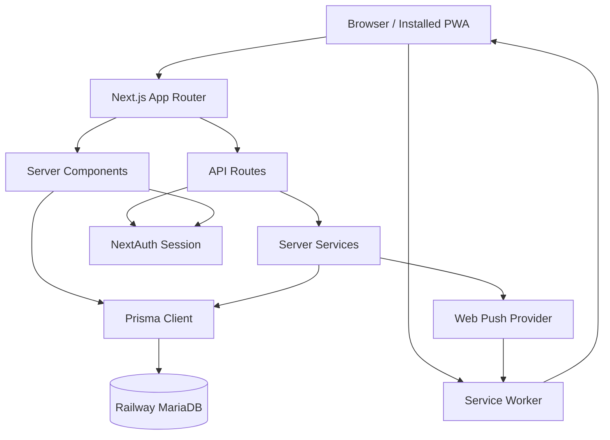

# TaskManager Architecture

**Status:** Living Document  
**Last Updated:** 2026-07-11  
**Last Verified Against Commit:** `ad1649d`  
**Repository Branch:** `main`  
**Working Tree Note:** This document also reflects pending documentation changes that are not represented by the verification commit.  
**Purpose:** Authoritative technical architecture reference for TaskManager. This document explains how the application is currently structured, how its major modules interact, and why key architectural decisions exist. It is intended for maintainers and future AI-assisted development sessions before significant technical changes are made.

**Audience:**

- Future maintainers
- AI coding assistants
- Contributors

## System Overview

TaskManager is a Next.js application for task tracking, delegated work, lightweight collaboration, time logging, reporting, and notifications. It is organised around user-owned profiles, project/task workflows, shared delegated tasks, collaborative spaces, and a central notification system with in-app and Browser Push delivery.

The architecture serves practical daily work rather than enterprise process modelling. Its main goals are clear ownership boundaries, low-friction task capture, visible work state, reliable notification delivery, and safe multi-user collaboration.

Core concepts include profiles as work contexts, tasks and projects as the primary planning model, delegated tasks as shared participant workflows, groups as user-visibility boundaries, and notifications as centralised domain events with multiple delivery channels.

## High-Level Architecture

TaskManager is a full-stack Next.js App Router application backed by Prisma and MariaDB. Most feature logic is implemented in server routes, server components, shared server-side services, and client components for interactive workflows.

Major layers:

- **Next.js application:** App Router pages, layouts, server components, client components, and API routes under `app/`.
- **Prisma:** Typed data access and migrations, with MariaDB as the configured provider.
- **MariaDB:** Production database hosted on Railway.
- **Authentication:** NextAuth credentials provider with JWT sessions.
- **API routes:** Authenticated JSON endpoints for tasks, projects, profiles, delegation, spaces, notifications, push subscriptions, timesheets, users, and check-ins.
- **Notification flow:** Central dispatcher creates in-app rows and triggers Web Push delivery when preferences allow it.
- **Browser Push:** `web-push` server library sends to stored subscriptions.
- **Service Worker:** Root-scoped `/sw.js` handles push display, active-tab suppression, badge updates, and notification clicks.
- **PWA:** Manifest and installed-app metadata enable standalone usage, including iPhone Home Screen push subscriptions.

## Architectural Principles

TaskManager favours server-side enforcement over client trust. Client components can improve ergonomics, but authentication, ownership, group visibility, delegated task permissions, and notification recipient checks must be enforced by server routes and shared server-side helpers.

Each domain concept should have a clear source of truth. Notification events flow through the dispatcher instead of separate in-app and Push systems. Database shape is defined by Prisma schema and migrations, not ad hoc production changes. Delegated tasks remain shared lifecycle records rather than disconnected task copies.

Shared services are preferred when behavior crosses routes or UI surfaces. New work should extend existing helpers, dispatchers, settings pages, and workflow components before introducing parallel implementations. Duplication is acceptable only when the abstraction would be weaker than the repeated code.

The codebase should evolve incrementally. Prefer focused migrations, small route/service changes, and compatibility-preserving UI improvements over large rewrites. Preserve backwards compatibility where practical, especially for existing data, notification preferences, delegated task state, and migration history.

Simplicity comes before abstraction. Add an abstraction when it removes real complexity, centralises a rule that must stay consistent, or matches an established local pattern. Avoid introducing queues, background systems, generic configuration layers, or new module boundaries before the measured need exists.

Database evolution is migration-first. Shared Railway databases must not be changed with `prisma db push`, reset operations, or undocumented migration-ledger edits. Documentation evolves with the codebase: significant architectural changes require this document to be reviewed, even when the result is "reviewed, no update required."

## Core Modules

### Profiles

Profiles are user-owned work contexts. They group tasks, projects, time entries, Sunday check-ins, and profile-level display preferences.

Responsibilities:

- Provide separate task spaces for a single user.
- Store default view and reporting preferences.
- Enable profile-specific routine support.
- Scope task, project, and timesheet ownership.

Relationships:

- A `User` owns many `Profile` records.
- A `Profile` owns tasks, projects, time entries, and Sunday check-ins.

### Overview

Overview is the cross-profile operational workspace. It aggregates the user's profile tasks and projects into a broader planning view.

Responsibilities:

- Surface tasks and projects across profiles.
- Support filtering, sorting, priority visibility, and context actions.
- Provide navigation into profile-specific task views.

Relationships:

- Reads from profile-owned tasks and projects.
- Respects the authenticated user's profile ownership.

### Tasks

Tasks are the core work item. They support due dates, start dates, completion, priority, category, notes, waiting-on metadata, ordering, recurrence, recurrence pauses, project grouping, and delegation.

Responsibilities:

- Represent actionable work.
- Support profile day/week/month planning.
- Track completion and reopening.
- Support recurring task generation and pause behavior.
- Serve as the underlying work item for delegated tasks.

Relationships:

- A task may belong to a profile.
- A task may belong to a project.
- A task may have many note-history entries.
- A task may have one delegated task wrapper.

### Projects

Projects group tasks within a profile and provide higher-level organisation.

Responsibilities:

- Group related tasks.
- Track project due dates, category, priority, archived/collapsed state, and ordering.
- Support profile task views and Overview workflows.

Relationships:

- A project belongs to one profile.
- A project has many tasks.

### Delegated Tasks

Delegated tasks coordinate work between two users: the delegator and the assignee.

Responsibilities:

- Create or wrap a task as delegated work.
- Track lifecycle state: pending, accepted, in progress, completed, closed, declined.
- Enforce participant-only actions.
- Generate delegated task notifications.
- Preserve shared notes and state transitions.

Relationships:

- A delegated task references one task.
- It references an assigned-by user and assigned-to user.
- Delegated notification target URLs route to Assigned To Me or Assigned By Me.

### Notifications

Notifications are centralised records and delivery events for user-facing updates.

Responsibilities:

- Store in-app notifications.
- Maintain unread/read/cleared state.
- Apply per-type notification preferences.
- Dispatch Web Push as a delivery channel.
- Provide notification center data and unread counts.

Relationships:

- A notification belongs to a recipient user.
- It may reference an actor user.
- Delegated task events are currently the primary notification source.

### Push Notifications

Push notifications are a delivery channel attached to the existing notification dispatcher, not a separate event system.

Responsibilities:

- Store multiple browser/device subscriptions per user.
- Respect global and per-type push preferences.
- Send Web Push through the server-side `web-push` library.
- Clean up expired subscriptions.
- Update send-time badge counts.
- Route notification clicks back into TaskManager.

Relationships:

- Uses `PushSubscription`, `NotificationPreference`, and `User.notificationPushEnabled`.
- Uses notification dispatcher payloads and existing delegated task target URLs.
- Uses `/sw.js` for push display and click handling.

### Timesheets

Timesheets track time entries by profile and week.

Responsibilities:

- Record manual and timer-sourced time entries.
- Support week navigation and current-week workflows.
- Feed reporting views.

Relationships:

- A time entry belongs to a profile.
- Time reports aggregate time entries across selected scopes.

### Reports

Reports summarise productivity, time, efficiency, activity, and profile-level work.

Responsibilities:

- Aggregate tasks, projects, time entries, activity logs, and check-in data.
- Provide user-facing and admin-facing reporting views.
- Support operational review rather than raw database inspection.

Relationships:

- Reads from profile-owned work for normal users.
- Admin reports may read broader activity data.

### Activity Log

Activity logs record notable user and system actions for audit and reporting.

Responsibilities:

- Capture task, project, profile, timesheet, space, and user activity.
- Support admin user activity reports and operational inspection.

Relationships:

- Activity records may reference users, profiles, tasks, projects, time entries, and spaces.

### Collaborative Spaces

Collaborative spaces provide shared matrix-style work areas with members, rows, columns, status options, cells, and cell notes.

"Collaborative Spaces" is the formal subsystem name; "Spaces" is the shorter label used in application navigation and routes.

Responsibilities:

- Support structured collaborative tracking outside profile task lists.
- Enforce space membership and owner permissions.
- Support column types, row state, cell updates, comments, and print views.

Relationships:

- A collaborative space has members.
- A space has matrix rows and columns.
- Cells connect rows and columns and may reference users or notes.

### Groups

Groups define user visibility boundaries.

Responsibilities:

- Control which users non-admin users can see or select.
- Scope delegated task recipient selection.
- Scope collaborative space member selection.

Relationships:

- Users join groups through membership records.
- Admin users can see all users.
- Non-admin users generally see themselves plus users sharing a group.

### Sunday Check-ins

Sunday Check-ins are profile-specific weekly reflection records. The current implementation supports a specialised Evie routine-support workflow rather than a general check-in platform for every user.

Responsibilities:

- Store selected check-in options and reflection text.
- Support the current routine-support profile workflow.
- Respect a fixed weekly cadence with Sunday-oriented availability and naming.
- Feed admin/user activity reporting.

Relationships:

- A check-in belongs to one profile and one week start.
- Availability depends on the profile's `routineSupportEnabled` flag.
- The current selectable options and summary are purpose-built for the routine-support workflow.

### Routine Support

Routine support is a profile-level feature for recurring personal support workflows.

Responsibilities:

- Mark profiles that participate in routine support.
- Summarise routine-related tasks and check-ins.
- Support routine reporting and streak-style operational insight.

Relationships:

- Uses profile flags, recurring tasks, routine-named projects, and Sunday Check-ins.
- It is not currently a broadly configurable feature that every user enables for themselves by default.

## Data Model Overview

The current Prisma schema is the source of truth. This section summarises the architecture rather than repeating the schema.

Major entities:

- **User:** Authenticated account. Owns profiles, group memberships, space memberships, notifications, notification preferences, push subscriptions, task notes, and delegated task relationships.
- **Profile:** User-owned workspace. Owns tasks, projects, time entries, and Sunday check-ins.
- **Task:** Work item. May belong to a profile and project. May be recurring. May be wrapped by a delegated task. Has note history.
- **Project:** Profile-scoped grouping for tasks.
- **DelegatedTask:** Lifecycle wrapper around a task, with assigned-by and assigned-to user references.
- **TaskNote:** Historical note/waiting-on entries attached to tasks.
- **Notification:** In-app notification row with recipient, optional actor, type, target URL, metadata, event key, read state, and cleared state.
- **NotificationPreference:** Per-user, per-notification-type in-app and push settings.
- **PushSubscription:** Per-device browser push subscription for a user. Uses a unique endpoint hash rather than indexing the full endpoint.
- **Group / UserGroup:** User visibility model.
- **CollaborativeSpace / SpaceMember / Matrix models:** Collaborative matrix workspace.
- **TimeEntry:** Profile-owned time tracking entry.
- **ActivityLog:** Auditable action log.
- **SundayCheckIn:** Weekly profile check-in record used by the specialised routine-support workflow.

Ownership model:

- Profile-owned resources are normally accessed through the authenticated user's profiles.
- Delegated tasks are accessible to their participants.
- Collaborative spaces are accessible to members.
- User discovery is constrained by group visibility unless the user is an admin.

Important constraints:

- Notification `eventKey` is unique to prevent duplicate in-app rows.
- Notification preferences are unique by user and notification type.
- Push subscriptions are unique by endpoint hash.
- Delegated task has a unique task relationship.
- Sunday check-ins are unique by profile and week start.
- Recurring tasks have constraints around profile, recurrence series, and start date.

## Notification Architecture

The notification system is implemented as one central domain notification pipeline with multiple delivery channels.

### Dispatcher

The dispatcher lives in the server-side notification service. Callers provide:

- recipient user id
- actor user id when applicable
- notification type
- title/body
- target URL
- metadata
- deterministic event key

The dispatcher evaluates in-app preferences, creates an in-app `Notification` row when enabled, and calls the push delivery service. Web Push delivery is currently awaited during notification dispatch, but failures are caught and do not roll back the delegated task action or the in-app notification flow. TaskManager does not currently use a queue, worker, cron job, or transactional outbox for push delivery.

This keeps event mapping centralised and avoids separate notification systems for in-app and push.

### In-App Notifications

In-app notifications are stored in the database. The notification center reads recent rows, shows unread counts, marks individual or all rows read, and clears individual or all rows by archiving them with `clearedAt`.

Unread counts are exposed through an authenticated API and are used by:

- notification bell badge
- notification panel
- browser title badge
- dynamic favicon badge
- app badge where supported

### Preferences

Preferences are split into:

- `NotificationPreference.inAppEnabled`
- `NotificationPreference.pushEnabled`
- `User.notificationPushEnabled`

Missing preference rows behave as:

- in-app enabled
- push disabled

This preserves existing in-app behavior while keeping push opt-in.

### Browser Push

Push delivery uses stored `PushSubscription` records and server-side VAPID configuration. A user may have multiple subscriptions for different browsers, devices, or installed app instances.

Push is sent only when:

- global push is enabled for the user
- per-type push is enabled
- at least one active subscription exists
- VAPID configuration is present and valid

Delivery is best-effort per subscription. One device failure does not block other devices or roll back the domain action.

### PWA And Service Worker

TaskManager has a web app manifest and a root-scoped service worker at `/sw.js`.

The service worker:

- receives push payloads
- updates app badge count where supported
- suppresses duplicate browser notifications when TaskManager is focused and visible
- shows browser notifications when the app is closed, backgrounded, hidden, or minimised
- handles notification clicks
- focuses or opens a TaskManager window
- rejects unsafe external click URLs

### Deep-Link Routing

Push and in-app notifications use the same target URLs. Current delegated notification destinations are existing list routes:

- assignee-facing events: `/delegated/assigned-to-me`
- delegator-facing events: `/delegated/assigned-by-me`

The delegated task id is stored in notification metadata and contributes to deterministic event keys, but it is not currently used by the delegated pages to select, scroll to, highlight, or open an individual task. TaskManager does not currently have a standalone delegated-task detail route or notification-specific modal/detail view.

Notification clicks therefore open the correct Assigned To Me or Assigned By Me list. The relevant delegated task is visible within that list alongside the user's other delegated tasks, subject to the page's normal open/closed filtering, ordering, and pagination.

If the user's authentication session has expired, normal route authentication behavior applies and the user must sign in before reaching the destination.

### Active-Tab Suppression

When a push arrives while a same-origin TaskManager client is focused and visible, the service worker does not show a duplicate browser notification. It sends a message to the open page so the in-app notification center and badge state can refresh.

This preserves the in-app notification center as the active-session experience while keeping browser/mobile notifications for background or closed app states.

### Badge Updates

The current badge model is intentionally lightweight:

- unread count is polled and refreshed by the notification center
- browser title is prefixed with the unread count
- favicon badge is generated dynamically where supported
- service worker push payload includes send-time `badgeCount`
- installed app badge is updated where the Badging API exists

Full real-time badge synchronisation across every read/clear event and every installed platform is not currently implemented.

### Expired Push Cleanup

When the push provider returns a permanent expiration status such as `404` or `410`, only the matching subscription is deleted. Temporary failures are logged and retained for future attempts.

## Security Architecture

TaskManager uses server-side enforcement as the primary security boundary.

### Authentication

Authentication uses NextAuth with credentials login and JWT sessions. API routes and server-rendered pages read the authenticated session server-side.

### Authorisation

Authorisation is enforced by route handlers and server-side helper functions. The main patterns are:

- profile resources require ownership by the authenticated user
- delegated task actions require sender or recipient participation depending on action
- collaborative spaces require space membership or ownership
- visible user lists are filtered through group visibility
- admin-only routes check the user's admin role

### Group Visibility

Groups define which users can see or select other users. Non-admin users are limited to themselves and users sharing a group. Admin users can see all users.

This affects delegated task recipient selection and collaborative space member selection.

### Delegated Task Permissions

Delegated task permissions are lifecycle-specific:

- assignee accepts, declines, starts, completes, and adds notes
- delegator closes completed work and adds notes
- both participants can view their respective delegated task lists
- note notifications are sent to the other participant only

### Feature Restrictions

Feature access is enforced server-side. The restricted Lost/Hatch feature is an example: access is gated by server-side email checks rather than client-side hiding alone.

## Database Strategy

TaskManager uses Prisma with MariaDB hosted on Railway.

### Prisma And MariaDB

The configured datasource provider is MySQL/MariaDB. Prisma Client is the application's primary database access layer.

The schema uses `relationMode = "prisma"`. This means Prisma models relationships at the application layer rather than relying on database-enforced foreign keys. This choice reflects legacy database compatibility constraints and reduces reliance on database engine behavior that has varied historically.

### Legacy Compatibility

The repository includes migration history from earlier development stages. Some legacy schema changes were previously applied outside Prisma's normal migration ledger and later reconciled after a migration-history audit.

Compatibility code should be removed only when the live schema and deployment history are verified to support removal.

### Migration Strategy

Schema evolution must use Prisma migrations. The repository explicitly prohibits `prisma db push` against the shared Railway database because it can alter live schema without creating or recording migrations.

Required workflow:

1. Update `prisma/schema.prisma`.
2. Create a named migration.
3. Review generated SQL.
4. Commit schema, migration, application code, and docs together.
5. Apply with `npx prisma migrate deploy`.
6. Confirm with `npx prisma migrate status`.
7. Run Prisma generation and project checks.

Manual migration-ledger reconciliation must be documented.

### Backup And Operational Cautions

Railway database backups and operational discipline are part of the production safety model. Destructive operations such as reset, migration deletion, or direct ledger edits must not be used on production data.

## Deployment Architecture

### Local Development

Local development runs the Next.js app with `npm run dev`. The application expects environment variables for database, authentication, and push configuration.

### Railway

Railway hosts the MariaDB database. `DATABASE_URL` points Prisma to the configured database.

### Vercel

The application is designed for deployment as a Next.js app on Vercel-style infrastructure. Production deployments must include all required environment variables and committed Prisma migrations.

### Environment Variables

Important variables include:

- `DATABASE_URL`
- `NEXTAUTH_SECRET`
- `NEXT_PUBLIC_VAPID_PUBLIC_KEY`
- `VAPID_PRIVATE_KEY`
- `VAPID_SUBJECT`

Only the VAPID public key is exposed to browser code. The private key must remain server-only.

### Deployment Flow

The expected deployment flow is:

1. Commit application changes and migrations.
2. Apply database migrations with `npx prisma migrate deploy`.
3. Confirm migration status.
4. Generate Prisma Client.
5. Build the application locally or in the hosting pipeline.
6. Deploy through the configured Vercel-style hosting flow.
7. Perform manual verification for affected workflows.

Production database safety rules remain unchanged: do not use `prisma db push` on the shared Railway database, do not run `prisma migrate reset` against production data, do not delete committed migration history, and do not make undocumented migration-ledger edits.

## Testing Strategy

TaskManager combines automated checks with manual workflow verification.

Automated tests currently cover:

- recurring task pause behavior
- push subscription validation and endpoint hashing
- push delivery preference behavior
- multiple-device push attempts
- expired subscription cleanup
- safe push target URL handling
- push payload mapping

Build verification uses `npm run build`, which also performs TypeScript checks.

Notification testing is split across automated and manual coverage:

- unit-style tests mock Web Push transport
- desktop manual tests verify browser notification behavior, active-tab suppression, title badge, favicon badge, and in-app notification center behavior
- iPhone/Home Screen manual tests verify installed app delivery and click routing
- notification settings, unread/read/clear workflows, and route-level UI behavior require manual verification unless matching automated tests are added

Deployment verification should include:

- Prisma validation
- Prisma client generation
- migration status
- production build
- smoke testing critical flows after deployment

## Known Technical Debt & Future Review

Outstanding architecture items and future review areas:

- **Permission helper consolidation:** Ownership and authorisation checks are still distributed across several route groups.
- **Polling optimisation:** Notification counts and some delegated counts use polling rather than real-time transport.
- **Badge synchronisation review:** Installed app badge updates are send-time and page-driven, not a complete cross-device sync system.
- **Synchronous Push delivery review:** Web Push is currently awaited during notification dispatch. Review an asynchronous queue or outbox only if measured production latency or delivery requirements justify the added complexity.
- **Sunday Check-in generalisation review:** The current Sunday Check-in supports a specialised routine-support workflow. A future generalised version could allow users to choose whether check-ins are enabled, which profile they apply to, preferred weekday, title or purpose, questions/options, and whether check-ins contribute to routine or reporting views.
- **Documentation upkeep:** README, Playbook, and architecture docs should be kept aligned after major feature commits.
- **Automated integrity checks:** Broader tests for route permissions, delegated lifecycle, timesheets, and collaborative spaces would reduce regression risk.
- **Legacy compatibility cleanup:** Any fallback paths for historical migration gaps should be reviewed after confirming all environments are reconciled.

## Maintaining This Document

This document is a living source, not a historical snapshot. Significant architectural changes require `docs/ARCHITECTURE.md` to be reviewed before the work is considered complete.

Factual descriptions must be verified against the current repository. Detailed historical reasoning belongs in `docs/DECISIONS.md`; user-facing introduction and setup belong in `README.md`; operational detail belongs in focused runbooks such as migration and operations documentation.

The Build Playbook PDF is a periodically generated snapshot derived from repository documents. The repository Markdown files remain the maintainable source.

## Architecture Review Register

| Area | Current Status | Next Review | Notes |
|---|---|---|---|
| Notifications | Implemented: in-app, preferences, browser push, active-tab suppression | After next notification feature | Review badge sync and delivery observability. |
| Delegated Tasks | Implemented core lifecycle and notification events | Before adding reopen/cancel/detail pages | Preserve participant-only permissions. |
| Permissions | Functional but distributed | Next security pass | Consider shared ownership helpers for profile/task/project routes. |
| Database Migrations | Reconciled and documented | Every schema change | Follow Prisma migration workflow; never use `db push` on Railway. |
| Collaborative Spaces | Implemented with member/owner helpers | Before major spaces expansion | Review tests and permission coverage. |
| Timesheets | Implemented manual/timer workflows | Before timer expansion | Review ownership and timer scoping assumptions. |
| Sunday Check-ins / Routine Support | Specialised Evie routine-support workflow | Before making check-ins available to general users | Do not treat the current Sunday-specific workflow as a general configurable check-in system. |
| PWA / Push | Implemented delivery for delegated notifications | After production push soak | Monitor expired subscriptions and platform badge limitations. |
| Documentation | Architecture document established | Each major commit | Keep README concise and Playbook operational. |

## Related Documents

- [`README.md`](../README.md): Project introduction, setup, and contributor overview.
- [`PROJECT_PLAYBOOK.md`](../PROJECT_PLAYBOOK.md): Product philosophy, build guidance, and long-term project manual.
- [`docs/PUSH_NOTIFICATIONS.md`](./PUSH_NOTIFICATIONS.md): Push notification implementation, behavior, testing, and troubleshooting.
- [`docs/DECISIONS.md`](./DECISIONS.md): Historical architecture and product decisions.
- [`docs/MIGRATION_HISTORY.md`](./MIGRATION_HISTORY.md): July 2026 migration reconciliation record.
- [`docs/PRISMA_MIGRATION_WORKFLOW.md`](./PRISMA_MIGRATION_WORKFLOW.md): Mandatory Prisma migration workflow.
- [`docs/OPERATIONS_MANUAL.md`](./OPERATIONS_MANUAL.md): Operational notes and deployment procedures.
