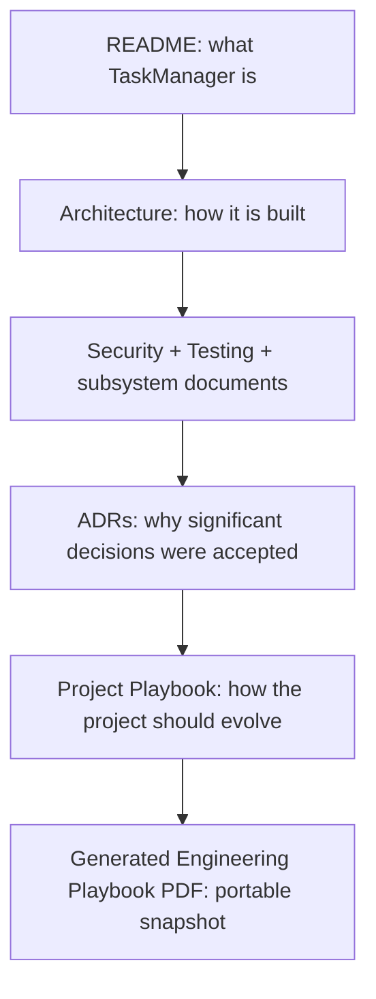
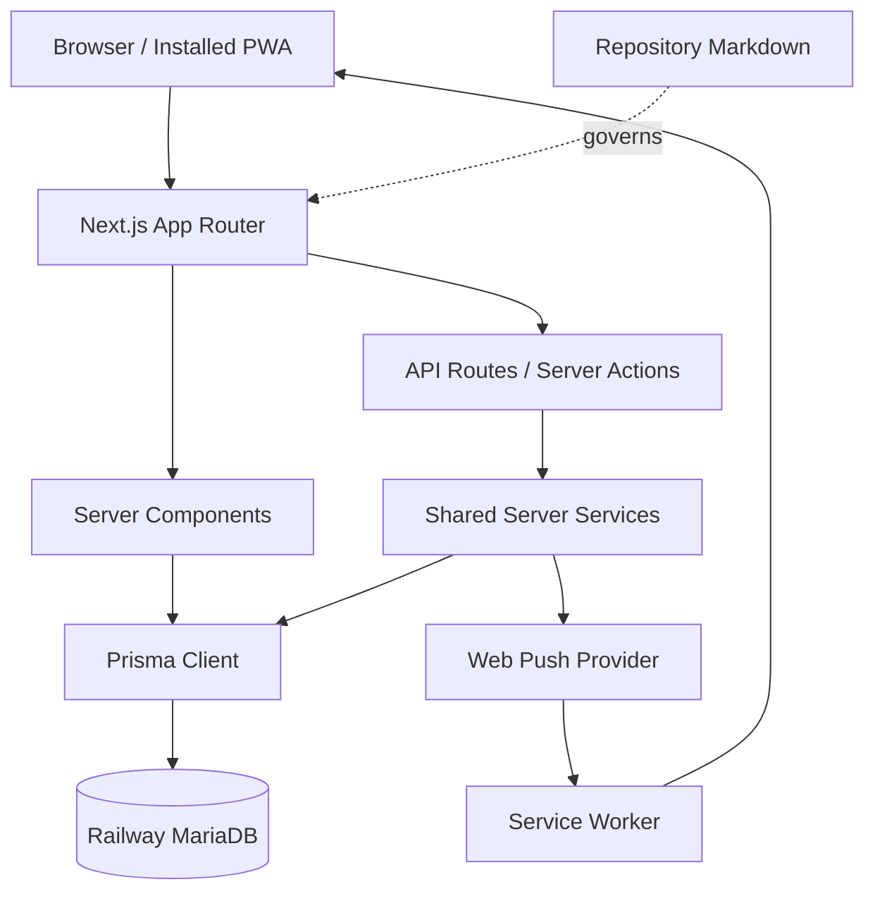

# TaskManager Engineering Playbook

## Build, Maintain and Evolve TaskManager Well

| Version | Edition | Status |
|---|---|---|
| 2.0 | Repository Edition | Draft Source for Review |

> The repository is the authoritative implementation. This Playbook is a curated operating handbook generated from TaskManager’s living repository documentation.

---

# Foreword

TaskManager has grown through practical use: first as a focused task manager, then as a multi-user system with delegated work, structured collaboration, reporting, routine support, and browser notifications. As that scope expanded, good engineering increasingly depended on more than knowing where a file lived. Maintainers also needed to understand why the system was shaped as it was, which boundaries must remain intact, and how to judge whether a change genuinely improved the product.

This Engineering Playbook exists to preserve that judgement. It brings together the project’s enduring philosophy, architectural decisions, security rules, verification expectations, operational discipline, and working practices for humans and AI assistants. It is not a substitute for the repository. Its purpose is to help readers approach the repository with the right questions.

Repository-First documentation matters because implementation and guidance must evolve together. TaskManager’s living Markdown documents sit beside the code, schema, migrations, and tests they describe. They can be reviewed in the same change, corrected when an audit uncovers a discrepancy, and traced to a commit. A generated handbook or PDF cannot offer that immediacy; it is necessarily a snapshot.

For that reason, this handbook is derived from the living documentation rather than maintained as an independent authority. It curates the material that a maintainer needs for sound decisions while directing detailed questions back to their owning sources. Future editions should be regenerated only after those sources have been reviewed and brought up to date.

Technical choices are rarely neutral. Whether to extend Overview or add another workspace, centralise a rule or leave it explicit, automate a check or retain manual verification—these decisions shape the product as much as code does. Documenting the principles behind them helps TaskManager remain coherent, secure, and useful as its implementation changes.

TaskManager is intentionally engineered to remain understandable. Every architectural decision, documentation standard, and engineering practice described in this Playbook exists to preserve that quality as the application grows.

---

# Quick AI Context

You are joining a TaskManager engineering conversation without relying on prior chat history. Read this Playbook first for working context, then inspect the current repository before proposing or making changes.

The repository is the source of truth. Documentation explains the repository; it does not override it. Verify material claims against current code, schema, migrations, tests, configuration examples, and uncommitted working-tree changes. If code and an older document disagree, report the discrepancy and follow the code unless the task is explicitly to change it.

Use the living documents by purpose:

- [`README.md`](../README.md) answers what TaskManager is and how to enter the repository.
- [`docs/ARCHITECTURE.md`](./ARCHITECTURE.md) explains how the application is built.
- [`docs/SECURITY.md`](./SECURITY.md) defines current security boundaries, invariants, gaps, and review triggers.
- [`docs/TESTING.md`](./TESTING.md) defines verification expectations, current coverage, and testing debt.
- [`docs/DECISIONS.md`](./DECISIONS.md) records accepted architectural rationale.
- [`PROJECT_PLAYBOOK.md`](../PROJECT_PLAYBOOK.md) contains living product philosophy, development standards, and Definition of Done.
- Subsystem documents own implementation and operational detail, including Push, migrations, and operations.
- Historical PDFs, DOCX files, backups, and planning notes are supporting references only.

Significant changes require documentation review. Never present an assumption, proposal, UI behavior, or old plan as implemented behavior. Keep Codex prompts scoped, evidence-based, explicit about files and exclusions, and precise about validation. Do not ask Codex to commit unless a commit is deliberately part of the request.

## Before Writing a Codex Prompt

- [ ] Identify the outcome, current behavior, and desired behavior.
- [ ] Inspect the repository and uncommitted changes first.
- [ ] Name the documents and implementation areas that must be verified.
- [ ] State which files may change and what is out of scope.
- [ ] Identify ownership, Group, delegated, Space, admin, notification, and Push implications.
- [ ] Identify schema or migration implications without assuming a migration is required.
- [ ] Specify automated, manual, security, and deployment validation.
- [ ] Require a factual final report, including failures and human confirmation.
- [ ] Say “Do not commit” unless an intentional commit is requested.

> **AI operating rule:** Inspect, verify, constrain, implement, validate, and report. A plausible answer without repository evidence is not sufficient.

---

# 1. Purpose and Scope

This chapter explains why the Playbook exists, how it relates to the living repository documents, and when a new publication snapshot should be produced.

The Playbook restores enough project context for a maintainer, contributor, project owner, or AI assistant to make safe engineering decisions after time away. It curates what the product values, how the systems fit together, how changes should be scoped, which security boundaries must survive, how verification should be chosen, and how operational and documentation risk should be managed.

It is not the repository’s universal source document. The README remains the entry point. Architecture owns current structure. Security owns security detail. Testing owns coverage and verification detail. ADRs own accepted rationale. Subsystem documents own implementation procedures. The living Project Playbook owns continuing product and engineering philosophy. This handbook connects those sources into an operating model without copying them wholesale.

The future PDF is a portable snapshot. It can be read away from the repository or uploaded into a future AI conversation, but it cannot know about commits made after generation. It must never compete with living Markdown. Regenerate it after material changes to architecture, security, testing, workflow, documentation ownership, operational practice, or accepted decisions—and only after the repository documents themselves are current.

## Source Document and Version Map

| Source document | Purpose | Status | Verified |
|---|---|---|---|
| [`README.md`](../README.md) | Project overview, capabilities, setup, and documentation entry point | Living repository document | 2026-07-12 |
| [`docs/ARCHITECTURE.md`](./ARCHITECTURE.md) | Authoritative current architecture and review register | Living repository document | 2026-07-12 |
| [`docs/SECURITY.md`](./SECURITY.md) | Security model, invariants, verified gaps, and review triggers | Living repository document | 2026-07-12 |
| [`docs/TESTING.md`](./TESTING.md) | Current verification system, coverage boundaries, and testing priorities | Living repository document | 2026-07-12 |
| [`docs/DECISIONS.md`](./DECISIONS.md) | Accepted Architecture Decision Records | ADR register | 2026-07-12 |
| [`PROJECT_PLAYBOOK.md`](../PROJECT_PLAYBOOK.md) | Living philosophy, workflow standards, documentation system, and Definition of Done | Version 1.1 | 2026-07-12 |
| [`HOW_TO_WORK_WITH_TASKMANAGER.md`](../HOW_TO_WORK_WITH_TASKMANAGER.md) | Short routing guide for AI coding assistants | Living quick-start document | 2026-07-12 |
| [`docs/PUSH_NOTIFICATIONS.md`](./PUSH_NOTIFICATIONS.md) | Browser Push implementation, behavior, manual tests, and troubleshooting | Focused subsystem document | 2026-07-12 |
| [`docs/OPERATIONS_MANUAL.md`](./OPERATIONS_MANUAL.md) | Deployment, backups, smoke tests, and incident cautions | Version 1.1 | 2026-07-12 |
| [`docs/PRISMA_MIGRATION_WORKFLOW.md`](./PRISMA_MIGRATION_WORKFLOW.md) | Mandatory migration workflow and ledger-reconciliation rules | Focused workflow document | 2026-07-12 |
| [`docs/MIGRATION_HISTORY.md`](./MIGRATION_HISTORY.md) | Historical record of the July 2026 migration reconciliation | Historical operational record | 2026-07-12 |

Detailed commit and working-tree provenance appears in the Source Attribution Note.

## Regeneration Triggers

Regenerate the reviewed PDF snapshot when one or more of these materially changes:

- accepted architecture or ADR register;
- authentication, roles, ownership, Groups, delegation, or Space permissions;
- test commands, coverage model, CI, browser automation, or test environments;
- schema/migration strategy or production database operation;
- notification delivery architecture, service worker, or supported device model;
- Documentation Hierarchy, conversation model, Codex prompt standard, or Definition of Done;
- a major subsystem is introduced, removed, or redefined;
- accumulated source corrections make the snapshot misleading.

Do not regenerate merely to conceal stale source documents. Review and update the owners first, record the source commit/date, perform editorial review, validate links and diagrams, and then generate the PDF in a separate authorised task.

---

# 2. TaskManager at a Glance

This chapter provides a high-level view of TaskManager’s current capabilities and the boundaries between its main product concepts.

TaskManager is a private multi-user work-management application designed for practical daily use. It combines personal work contexts with limited, explicit collaboration rather than modelling a large enterprise organisation.

**Profiles** are user-owned work contexts. They organise tasks, projects, time entries, reports, preferences, and optional routine support. They are not user accounts or general permission containers.

**Tasks and Projects** form the core planning model. Tasks support dates, completion, priority, categories, notes, recurrence, pauses, ordering, project association, and delegation. Projects group profile work and carry their own planning and display state.

**Overview** is the main cross-profile operational workspace. It presents active work across a user’s profiles and is the preferred home for broad planning controls before another dashboard is invented.

**Delegated Tasks** support shared ownership, accountability, and collaboration between an original delegator and an assignee. The implemented lifecycle is Pending, Accepted, In Progress, Completed, Closed, or Declined. Both participants can add shared notes; lifecycle actions are role-specific.

**Groups** control user discovery. Standard users see themselves and users who share a Group; administrators have broader visibility. Groups do not expose another user’s profiles.

**Collaborative Spaces**—“Spaces” in the UI—are structured matrix-style workflows with members, owners, rows, columns, typed cells, statuses, assignments, and notes. They are not intended to replace profile tasks or become generic project boards.

**Notifications** are database-backed recipient records produced through a central dispatcher. Delegated events can create in-app notifications and can also trigger Browser Push according to global and per-type preferences.

**Browser Push and PWA behavior** deliver eligible notifications to subscribed browsers and installed apps, provide safe notification-click navigation, and update supported badges. Detailed delivery mechanics belong in the Architecture and Push documentation.

**Timesheets** provide manual entries and timers, week navigation, duration and rounding calculations, and reporting inputs. Current timer ownership is a known security defect, not a guaranteed boundary.

**Reports and Activity Log** summarise tasks, time, efficiency, completion, and user activity. Standard users see their own activity; administrators have cross-user activity and routine-report access where explicitly implemented.

**Sunday Check-ins and Routine Support** currently implement a specialised, Brisbane-aware routine-support workflow on enabled profiles. They are not yet a general configurable check-in platform.

TaskManager deliberately favours clarity, practical workflows, and focused collaboration over enterprise-scale complexity.

---

# 3. TaskManager Engineering Philosophy

This chapter sets out the principles used to judge TaskManager changes. They favour practical visibility, incremental evolution, clear ownership, and deliberate restraint over unnecessary process or abstraction.

## Overview First

Overview is the application’s primary operational workspace because daily work crosses profiles. New cross-profile filters, planning controls, or broad status views should be considered there before creating a separate command centre. Profile pages remain the focused workspace for one context. The test is not “could this be a new page?” but “does a new page reduce friction more than extending Overview?”

## Capture First, Organise Later

Task entry must remain quick. A work-management system fails if recording work requires too much classification before the work can exist. Optional structure—project, category, recurrence, notes, due date—should enrich a task without making capture feel like form administration.

## Visibility Beats Complexity

TaskManager exists for individuals and small teams, not as a Jira-like process engine. Prefer a clear status, compact indicator, focused list, or useful report over another approval layer or configurable workflow engine. More flexibility is not automatically more usable.

## Simplicity Before Abstraction

An abstraction is valuable when it centralises a rule that must remain consistent, removes repeated risk, or matches an established domain boundary. The central notification dispatcher is a good abstraction because event types, preferences, target URLs, duplicate keys, and delivery channels must agree. A generic framework for every route would be harmful if it obscured the exact ownership or lifecycle predicate.

## Name Things Carefully

Names become part of the architecture. Prefer names that describe an enduring responsibility rather than a temporary implementation: Profiles are work contexts, Overview is the cross-profile workspace, Groups define discovery, Collaborative Spaces provide structured shared workflows, and Browser Push is a delivery channel. Careful naming keeps boundaries visible and makes later changes easier to reason about.

## Incremental Evolution Over Rewrites

Extend current systems before replacing them. Small migrations, focused server changes, reused components, and compatible data evolution are easier to review and recover than broad rewrites. Rewrites are justified only when current structure demonstrably prevents the required outcome and the migration path is understood.

## Shared Systems Over Duplication

When behavior must stay aligned across entry points, share it. Notifications flow through one dispatcher rather than separate in-app and Push implementations. Task action definitions should converge across Overview and profile screens. Shared does not mean “abstract everything”; it means one source for a rule that genuinely has multiple consumers.

## Backwards Compatibility Where Practical

Existing data, profile workflows, recurrence behavior, notification preferences, delegated state, migration history, and user habits have value. Preserve them unless a deliberate change is worth the migration and communication cost. Compatibility safeguards should be explicit and temporary when they exist, not silent permanent complexity.

## Repository-First Documentation

Documentation must be checked against implementation. It is evidence-informed guidance, not a substitute for inspecting code. A documentation audit can expose real defects—as happened when ownership review identified profile-reorder and timer gaps.

## One Owner Per Topic

Each topic needs one primary home. Architecture owns structure; Security owns boundaries; Testing owns verification; Push owns Push detail; migration documents own database process. Other documents link and summarise. This reduces conflicting advice and makes corrections tractable.

## Documentation Evolves With Code

Documentation review is part of completion, not later housekeeping. “Reviewed — no update required” is valid when deliberate. Skipping the review because a change seems small is not the same result.

## Applying the Philosophy to Decisions

The philosophy is most useful when it changes a decision. Before adding a feature or abstraction, work through four questions.

First, identify the user friction. “The product should have dashboards” is not a problem statement. “Users must enter three profile pages to see work due today” is. The latter points toward Overview; the former may produce an ornamental parallel system.

Second, find the current owner. If the change concerns event delivery, the notification dispatcher already owns the event. If it concerns cross-profile planning, Overview is the likely owner. If it concerns structured shared matrix work, inspect Collaborative Spaces. A new module should not be the default answer when a current owner exists.

Third, identify the boundary that could be weakened. A user picker invokes Groups. A task endpoint invokes profile ownership. A delegated action invokes participant and state. A Space operation invokes membership and sometimes owner role. A schema shortcut invokes migration and relation-mode risk. Product simplicity never excuses missing protection.

Fourth, choose the smallest complete change. “Small” does not mean incomplete. A complete ownership fix includes the server predicate, the correct response behavior, wrong-user regression coverage, documentation review, and deployment verification. It does not need an organisation-wide policy engine.

| Proposed change | Likely good direction | Warning sign |
|---|---|---|
| Add another cross-profile task view | Extend Overview filters or grouping | A separate dashboard with copied task actions |
| Notify on a new delegated event | Add an event through the central dispatcher | Direct notification inserts and separate Push copy |
| Add a user selector to a workflow | Reuse Group-scoped server visibility | Fetch all users and filter only in React |
| Reuse an ownership predicate | Extract a narrow, named helper with explicit inputs | A universal permission DSL that hides domain rules |
| Improve shared operational tracking | Extend Space types/columns when the matrix model fits | Rebuild profile task management inside Spaces |
| Change a live field | Create and review a migration with data handling | `db push` because it is quicker |

> **Engineering principle:** Product restraint and engineering completeness are compatible: build less, but finish what is built.

---

# 4. Documentation System

This chapter explains how TaskManager’s living documents divide responsibility, how they should evolve with the code, and why generated publications remain snapshots rather than sources of truth.

## Documentation Hierarchy



The diagram is a reading progression, not a precedence rule over code. The repository implementation remains authoritative.

Documentation is an engineered product. Its structure, ownership, review, and maintenance should be designed as deliberately as software so that guidance remains useful as the implementation evolves.

| Document | Question answered | Belongs there | Does not belong there |
|---|---|---|---|
| README | What is TaskManager? | Orientation, capabilities, setup, command entry points, document links | Full architecture, detailed runbooks, exhaustive security guidance |
| Architecture | How is it built now? | Layers, modules, data model overview, interactions, review register | Product wishlists, complete route references, old plans |
| Security | What protects identity and data? | Trust boundaries, ownership, roles, invariants, verified debt | Generic security textbook material or unverified guarantees |
| Testing | How is it verified? | Commands, coverage inventory, change matrix, manual workflows, gaps | Claims of tests that do not exist or full feature manuals |
| Subsystem documents | How does this focused system work? | Push, migrations, operations, or future focused detail | Restating the entire product |
| ADRs | Why was a significant choice accepted? | Context, decision, rationale, consequences, review trigger | Current architecture duplicated in full |
| Project Playbook | How should TaskManager continue to be built? | Product philosophy, standards, documentation policy, Definition of Done | Volatile implementation detail |
| Generated handbook/PDF | What portable context should a reader carry? | Curated summaries, operating rules, checklists, source references | New authoritative facts or instructions absent from living sources |

## Repository-First Documentation

Make changes in the owning Markdown document first. Generated outputs follow. Do not edit a PDF to correct architecture while leaving Architecture wrong. Historical notes can explain how a decision arose, but current code and current repository documents define today’s system.

## Documentation Ownership

Before adding a new document, ask whether an existing owner can absorb the material. Create a focused document only when the topic has a distinct audience, maintenance cycle, or operational depth. Link to the owner instead of cloning a section.

## Documentation Evolution

Documents should become clearer as the system matures. Remove obsolete guidance. Reconcile contradictions. Promote stable decisions to ADRs. Move detailed procedures into focused documents. Resist endless accumulation: completeness is not measured by page count.

## Generated PDF as Snapshot

The eventual PDF is useful for onboarding and AI context restoration. It must state its source commit and date, identify included working-tree changes, and tell readers to verify against the repository. Regenerate after source review; never use generation to bypass it.

## Definition of Done for Documentation

- Review Architecture for structural or system-interaction changes.
- Review Security for authentication, ownership, collaboration, logging, secrets, or data-isolation changes.
- Review Testing when commands, coverage, high-risk workflows, or verification expectations change.
- Review README when public capabilities, setup, commands, or project status change.
- Review ADRs when accepted rationale changes or a new significant decision is made.
- Review subsystem and operations documents when their procedures change.
- Review the Project Playbook for philosophy, standards, or Definition of Done changes.
- Record “Reviewed — no update required” when that is the honest outcome.

## Documentation Change Patterns

Four patterns cover most documentation work.

**Behavior changed:** update the owning factual document in the same change. A new notification event changes Architecture/Push and may change Security/Testing. A new role changes Security, Architecture, Testing, and likely an ADR. Cross-references should remain short.

**A defect was discovered:** document current reality before or with the fix. If the defect remains, name the gap and practical risk without advertising unnecessary exploit detail. When fixed, replace the debt statement with the implemented protection and add the regression test to Testing.

**A decision changed:** update implementation and current architecture, record the rationale in a new or superseding ADR, update the living Playbook if its principle changed, and regenerate snapshots later. Do not silently rewrite an accepted ADR as if the earlier decision never existed.

**Documentation was refactored:** improve clarity, organisation, terminology, or reading flow without changing technical facts. Review the source evidence, preserve the owning document, and ensure the refinement does not create a second authority.

Documentation can also carry uncertainty honestly. “Hosting header behavior requires target-environment confirmation” is more useful than a guessed guarantee. A human-confirmation list is not weakness; it defines where repository evidence ends.

---

# 5. Working With AI and Codex

This chapter defines how TaskManager work is divided across conversations and how scoped, evidence-based Codex prompts should be prepared and reviewed.

Separating conversations by decision type prevents implementation detail, architecture governance, and product ideation from collapsing into one undifferentiated chat.

Codex is an implementation assistant, not the project architect. Product direction, architectural boundaries, naming, prioritisation, and acceptance remain matters of engineering judgement. The best prompts minimise ambiguity rather than maximise detail.

## Development Conversation

Owns feature implementation, code-level debugging, migrations, test execution, and intentional commits. It should receive a scoped prompt with repository evidence and clear validation. Implementation stays here even when the prompt was prepared elsewhere.

## Documentation & Architecture Conversation

Owns README, Architecture, Security, Testing, ADRs, Playbook work, technical-debt curation, release-note review, repository audits, and documentation-related Codex prompts. This is normally where a prompt for documentation or architecture work is designed and checked for consistency.

## Product & Roadmap Conversation

Owns future ideas, prioritisation, workflow improvement, UI/UX concepts, wireframes, and long-term direction. Product decisions can become engineering prompts after scope and priority are agreed. A roadmap idea is not implemented behavior.

These are working boundaries, not separate repositories. Information should cross between them deliberately: product defines the desired outcome; documentation/architecture frames constraints and decisions; development implements and verifies.

## Codex Prompt Standard

A good Codex prompt reduces ambiguity without dictating an unverified solution. Include:

1. **Goal** — the user-visible or repository outcome.
2. **Current behavior** — verified facts and known gaps.
3. **Desired behavior** — what must change and what must remain.
4. **Repository inspection requirements** — code, docs, tests, and working tree to inspect.
5. **Files to review** — likely evidence sources.
6. **Files allowed to change** — explicit mutation boundary.
7. **Out of scope** — adjacent work that must not be absorbed.
8. **Constraints** — compatibility, style, product, and operational rules.
9. **Security considerations** — identities, owners, Groups, roles, participants, recipients, memberships, secrets.
10. **Database considerations** — schema impact, migration rules, existing data.
11. **Testing requirements** — automated and manual checks, negative cases, devices, dates.
12. **Documentation impact** — owning documents to review.
13. **Validation** — exact commands and diff/status checks.
14. **Final report** — changed files, behavior, checks, failures, human confirmation.
15. **Commit instruction** — normally “Do not commit.”

Scoped prompts are safer than broad rewrites because they expose trade-offs, protect unrelated working-tree changes, and make validation meaningful. “Improve security” is too broad. “Add owner scoping to profile reorder, preserve per-user order semantics, add wrong-user route regression tests, update Security and Testing, and do not change schema” is reviewable.

## Reusable Codex Prompt Skeleton

```text
Goal
<Concrete outcome>

Current behavior
<Verified implementation and known discrepancy>

Desired behavior
<Required result and preserved behavior>

Repository review
- Inspect uncommitted changes.
- Verify claims against <files/areas>.

Allowed changes
- <files or directories>

Out of scope
- <explicit exclusions>

Constraints
- Preserve <compatibility/security/product rules>.
- Do not expose secrets or private identities.

Database and security
- <ownership/role/Group/migration expectations>

Verification
- <tests, lint, build, manual/API/device checks>
- Review the complete diff and documentation impact.

Final report
- Files changed, behavior, validation results, gaps, human confirmation.

Do not commit.
```

## Before Writing a Codex Prompt

- [ ] Has the current repository and working tree been inspected?
- [ ] Is this implementation, architecture, documentation, operations, or roadmap work?
- [ ] Can an existing service, screen, route, helper, or document be extended?
- [ ] Would the proposal create a parallel notification, task-action, preference, or collaboration system?
- [ ] Which user owns the data? Is ownership checked server-side?
- [ ] Do Groups affect discovery or assignment?
- [ ] Are delegated participants or lifecycle states affected?
- [ ] Does a Collaborative Space require membership or owner status?
- [ ] Are notification recipients, preferences, targets, or Browser Push affected?
- [ ] Is a Prisma schema change genuinely required? What migration and data-preservation work follows?
- [ ] Are existing data, routes, preferences, and workflows preserved?
- [ ] What automated, direct-API, multi-user, date-boundary, browser, device, and deployment checks are required?
- [ ] Which living documents own the changed facts?
- [ ] What exact status and limitations must Codex report?

## Reviewing Codex Output

- [ ] Does `git diff` contain only authorised files and intended behavior?
- [ ] Were pre-existing working-tree changes preserved?
- [ ] Are factual claims tied to current code rather than memory?
- [ ] Are client restrictions backed by server enforcement?
- [ ] Are owner, Group, role, participant, recipient, and membership predicates correct?
- [ ] If schema changed, is there a reviewed migration and a safe application plan?
- [ ] Were the requested tests and manual checks actually run?
- [ ] Are lint/build failures reported without claiming success?
- [ ] Was documentation impact reviewed in the owning documents?
- [ ] Are skipped checks and human confirmation explicit?
- [ ] Is the change ready for an intentional, focused commit?

## Prompt Scoping Examples

A weak prompt asks Codex to “clean up permissions.” It does not identify the failing behavior, the intended owner, which routes are in scope, or how safety will be demonstrated. It invites unrelated refactoring and makes completion subjective.

A strong prompt says that the profile reorder route currently queries all Profiles, that ordering must be per authenticated owner, that another user’s IDs must not be accepted or returned, that application code and route tests may change but schema may not, and that Security/Testing must be updated after direct wrong-user verification. It gives Codex a falsifiable outcome.

Likewise, “make Push reliable” is too broad. A useful prompt names the observed failure—such as an expired subscription blocking another device—then asks Codex to inspect the delivery core, retain best-effort domain behavior, test `404`/`410` cleanup and temporary failures, avoid logging endpoint/key material, update Push documentation, and report real-device checks as human work.

Good prompts also protect the working tree. If Security and Testing drafts are uncommitted, say they must be preserved and may be updated only where the task requires. Codex should not assume every modification is its own or revert unrelated work to obtain a clean diff.

## Human Decisions Codex Must Not Invent

Some questions cannot be safely answered from code alone:

- whether a new workflow belongs in Overview, a Profile, a Space, or a new surface when product intent is genuinely ambiguous;
- whether a new role should have broader access than current `user`/`admin` behavior;
- whether existing data may be transformed or deleted;
- whether a breaking workflow change is acceptable;
- which hosted database/environment is authorised for a migration;
- whether a new dependency, external service, or operational cost is acceptable;
- whether a discovered defect should expand the current task beyond documentation or diagnosis.

Codex should surface the choice, evidence, and consequences. It should continue with reasonable assumptions only when the result remains inside the requested scope and is reversible.

## When Not to Use Codex

Do not begin with an implementation prompt when the real work is early product thinking, architecture exploration, naming, prioritisation, or workflow design. Resolve the decision far enough to state the desired outcome and constraints first. Codex can inspect evidence and help evaluate options, but it should not turn an unsettled question into accidental architecture.

## Working Across Multiple Codex Turns

Long work benefits from explicit checkpoints. Discovery should end with a concise statement of current behavior and risks. Implementation should begin from that verified model. Validation should report actual command output, not expected output. If the user changes scope, preserve completed useful work and stop the superseded branch of work.

For high-risk tasks, ask for phased delivery: first audit, then proposed change, then implementation, then validation. This is especially useful for migrations and permissions. It is less useful for a small, well-specified documentation link. Process should match risk.

---

# 6. Architecture Overview

This chapter summarises TaskManager’s technical shape, the responsibilities of each application layer, and the boundaries that deserve particular care.

The architecture deliberately favours explicit domain boundaries over highly abstract infrastructure. Shared services centralise behavior that must agree, while routes retain visible authorisation rules for the resource and action they own.

TaskManager is a full-stack Next.js App Router application written in TypeScript and React. Server components load authenticated page data; API route handlers perform mutations and JSON reads; client components provide interactive workflows. Shared server modules contain Prisma access, activity logging, notification dispatch, Push delivery, recurrence/reporting support, and domain helpers.

Prisma models the application against MariaDB on Railway. The runtime uses the MariaDB adapter and `relationMode = "prisma"`. NextAuth v4 provides Credentials authentication with JWT sessions. Vercel-style hosting runs the Next.js application. Browser Push is delivered server-side through `web-push`; a root service worker receives payloads, suppresses duplicates for an active tab, updates badges where supported, and routes notification clicks to safe internal paths.



This diagram omits detailed domain relationships. Use [`docs/ARCHITECTURE.md`](./ARCHITECTURE.md) for the current module and data-model reference.

## Responsibility by Layer

**Client components** own interaction state: forms, menus, drag/reorder experiences, responsive presentation, optimistic-feeling refreshes, and browser APIs. They may hide an action or filter a list for convenience, but they cannot decide whether a user is allowed to perform the action.

**Server components** own authenticated page loading and server-rendered access decisions. Profile pages resolve the session and owned profile before loading task/project data. Admin and restricted pages check current database state rather than trusting a client role flag.

**API routes and server actions** are the mutation boundary. They parse input, resolve the current user, validate parent/child relationships, apply ownership or collaboration rules, perform transactions, create activity records, and invoke notification services. Direct calls must be safe even if the normal UI would never issue them.

**Shared server services** centralise cross-route behavior where consistency matters. Examples include Prisma creation, activity logging, user visibility, notification operations, delegated notification mapping, Push subscription handling, and Push delivery. A service does not remove the route’s responsibility to supply an authorised actor and correctly scoped resource.

**Prisma and MariaDB** store durable state. Prisma provides typed access and application relation handling. MariaDB persists the data but, under the current relation mode and legacy history, cannot be assumed to enforce every modeled relationship physically.

**The service worker** is a browser execution boundary separate from the React page. It can receive Push when the page is absent, display OS notifications, communicate with active clients, and open/focus internal routes. Changes must be tested in real browsers because a build cannot model lifecycle and permission behavior.

## Data Flow Example: Delegated Completion

When an assignee completes delegated work, the browser calls the completion route. The route resolves the session user, loads the delegated record, confirms the actor is the assignee and the state is In Progress, and performs a conditional update to Completed. It records a task note and asks the delegated-notification adapter to notify the original delegator. Notification preferences determine in-app and Push channels; Push failure is caught and must not reverse completion.

That single flow crosses authentication, participant authorisation, lifecycle validation, database concurrency, history, notification recipient selection, preferences, Push, and UI refresh. A “small” change to completion copy or state can therefore require more than a component test. Architecture review means tracing the entire flow, not only the edited file.

## Boundaries That Deserve Extra Attention

- IDs supplied by the browser must be re-associated with the authenticated owner or accessible parent.
- Nullable historical relations must not be treated as guaranteed live users or profiles.
- A user being visible through Groups does not make their owned data visible.
- An admin role grants only the explicit admin behaviors implemented by a route/page.
- Space membership grants broad matrix collaboration but not profile ownership.
- Notification and Push delivery are side effects; domain state remains authoritative.
- UI state is never evidence of server authority.
- Static assets are public, while application data routes require their own enforcement in addition to proxy behavior.

---

# 7. Architectural Principles and Decisions

This chapter distils the accepted Architecture Decision Records into practical guidance. The current register contains nine decisions; their operational meaning matters more than memorising their numbers.

| Decision | Why it matters | Practical implication |
|---|---|---|
| Overview is the primary workspace | Cross-profile visibility reduces navigation friction. | Consider Overview before another cross-profile dashboard. Keep profile pages focused. |
| Profiles are work contexts, not permission boundaries | Organisation and identity are different concerns. | Validate profile ownership, but do not use profiles as team accounts or user-discovery rules. |
| Groups define user visibility | Collaboration should not expose every account. | Apply Group scoping to server-side user searches, pickers, assignments, and invitations. |
| Collaborative Spaces are structured workflow tools | Their value is shared operational structure, not generic boards. | Preserve membership/owner rules, matrix semantics, archive behavior, and separation from profile tasks. |
| Prisma relation mode is retained for legacy database compatibility | Historic database constraints made physical foreign keys unsuitable. | Treat application validation, deletion behavior, migrations, and orphan review as integrity-critical. |
| Notifications use a central dispatcher | Event mapping and preferences must remain consistent. | Domain routes call the notification path; do not insert ad hoc notification rows or parallel mappings. |
| Browser Push is a delivery channel | In-app and Push represent the same domain event. | Reuse types and targets; Push failure must not undo domain work. Avoid Push-only event logic without review. |
| Database evolution is migration-first | Schema, migration files, and the ledger must remain aligned. | Create named migrations, review SQL, deploy committed migrations, and never `db push` shared Railway. |
| Documentation is Repository-First | Living guidance must evolve with implementation. | Update owning Markdown, review docs in the Definition of Done, and treat generated PDFs as snapshots. |

Read [`docs/DECISIONS.md`](./DECISIONS.md) for context, rationale, consequences, and review triggers.

Not every implementation choice requires an ADR. Record one when a decision changes a durable architectural boundary, security model, data strategy, operational rule, or long-term product structure. Accepted ADRs should not be silently rewritten: follow their review triggers and record a significant change through a new or superseding decision.

Generated handbooks may summarise accepted decisions, but changes to architectural rationale belong in [`docs/DECISIONS.md`](./DECISIONS.md) first.

---

# 8. Major Systems

This chapter provides a concise map of TaskManager’s major systems, their defining rules, and the constraints future work must preserve. Detailed behavior remains in Architecture and the relevant subsystem documents.

## Profiles

- **Purpose:** Separate a user’s work into meaningful contexts.
- **Key rule:** A profile identifier never grants access; ownership is derived from its user relationship.
- **Relationships:** Profiles own ordinary tasks, projects, time entries, Sunday Check-ins, and preferences.
- **Preserve:** Low-friction switching, per-profile organisation, and server-side ownership. Do not turn Profiles into users or general shared workspaces.
- **Sources:** Architecture, Security, ADR-002.

## Overview

- **Purpose:** Show and operate on work across the authenticated user’s profiles.
- **Key rule:** Page-wide filters, sorts, and grouping belong to Overview controls.
- **Relationships:** Overview reads profile-owned tasks and projects and links into focused profile views.
- **Preserve:** Scannability, compact controls, responsive behavior, and reuse of task actions. Avoid a competing dashboard without a strong reason.
- **Sources:** README, Project Playbook, ADR-001.

## Tasks and Projects

- **Purpose:** Model actionable work and its higher-level grouping.
- **Key rule:** Task and Project mutations remain scoped through the owning Profile unless an explicit collaboration model applies.
- **Relationships:** Tasks may belong to Projects, carry notes and recurrence state, and have one delegated wrapper; Projects belong to one Profile.
- **Preserve:** Capture speed, date semantics, recurrence history, shared action behavior, destructive confirmation, and compatibility with reporting. Waiting On is derived from the latest note rather than a separate Task field.
- **Sources:** Architecture and Project Playbook.

## Delegated Tasks

- **Purpose:** Coordinate work between a delegator and assignee.
- **Key rule:** Participant identity and allowed current state are validated server-side for every lifecycle action.
- **Relationships:** One delegated record wraps one Task and references nullable historical participants; notes and notifications connect the two users.
- **Preserve:** Pending → Accepted → In Progress → Completed → Closed, with Pending → Declined as the alternative. The assignee accepts, declines, starts, and completes; the delegator closes; both add notes. Do not invent reopen, cancel, or reassignment without an explicit design. Acceptance can currently copy a Task into an assignee-owned Profile and move the delegated wrapper, which conflicts with older Playbook wording and needs deliberate review before related changes.
- **Sources:** Architecture, Security, Testing.

## Groups and User Visibility

- **Purpose:** Limit who can discover and select whom.
- **Key rule:** Standard users see themselves and shared-Group users; admins can see all existing users.
- **Relationships:** Visibility affects user APIs, delegated recipients, Space members, assignments, and some identity attribution.
- **Preserve:** Server-side filtering. Visibility is not ownership and does not expose a visible user’s Profiles.
- **Sources:** Security and ADR-003.

## Collaborative Spaces

- **Purpose:** Provide shared, structured operational matrices.
- **Key rule:** Reads and content mutations require membership; membership administration and Space deletion require owner status.
- **Relationships:** Spaces contain members, rows, columns, status options, cells, typed values, and cell-note history.
- **Preserve:** Group-scoped member selection, child-to-Space validation, archive/restore, only-owner protection, and deletion constraints. Ordinary members can perform many row, column, status, cell, and note actions; do not describe all destructive actions as owner-only.
- **Sources:** Architecture, Security, ADR-004.

## Notifications

- **Purpose:** Provide the canonical recipient-facing record of domain events and coordinate delivery channels.
- **Key rule:** Reads and mutations are scoped to the authenticated recipient.
- **Relationships:** Delegated adapters create typed events; preferences control in-app and Push independently; event keys protect in-app persistence from duplicate creation.
- **Preserve:** Central dispatch, internal targets, recipient ownership, preference independence, and failure isolation. Browser Push remains a replaceable delivery mechanism rather than a second source of notification logic.
- **Sources:** Architecture, Security, Push, ADR-006.

## Browser Push and PWA

- **Purpose:** Deliver eligible notification events to subscribed browsers and installed apps.
- **Key rule:** Private VAPID and subscription key material remain server-side; Push never grants domain access.
- **Relationships:** Per-device subscriptions belong to a user; Web Push delivers to the service worker; the worker controls display and safe clicks.
- **Preserve:** Multi-device fan-out, expired-subscription cleanup, hashed endpoint logging, active-tab suppression, same-origin routing, and real-device verification. Push is synchronous and best-effort in the current request path and may later warrant measured delivery architecture review.
- **Sources:** [`docs/PUSH_NOTIFICATIONS.md`](./PUSH_NOTIFICATIONS.md), Security, Testing, ADR-007.

## Timesheets and Timers

- **Purpose:** Record manual and timed work for Profiles and reporting.
- **Key rule:** Manual time entries are Profile-owner scoped; timer start/stop currently fail to enforce this boundary and must not be presented as secure.
- **Relationships:** Entries belong to Profiles and feed reports and activity logs; timers create open entries and stop them with configured rounding.
- **Preserve:** Monday week behavior, duration and rounding semantics, Profile ownership, and reporting consistency. Fix timer isolation with two-user regression tests.
- **Sources:** Architecture, Security, Testing.

## Reports and Activity Log

- **Purpose:** Make completed work, time, productivity, and operational changes understandable.
- **Key rule:** Standard activity is scoped to the current user; cross-user activity reporting is explicitly admin-only.
- **Relationships:** Reports aggregate Profile Tasks and time; activity records capture actor, type, descriptions, resource IDs, and selected metadata.
- **Preserve:** Calculation clarity, known date/timezone assumptions, data isolation, and concise operational descriptions.
- **Sources:** Architecture, Security, Testing.

## Sunday Check-ins and Routine Support

- **Purpose:** Support a specialised routine-enabled Profile workflow with weekly reflection and streak/expectation summaries.
- **Key rule:** Check-ins require an owned, routine-enabled Profile and currently enforce Sunday behavior using Australia/Brisbane.
- **Relationships:** Sunday Check-ins belong to Profiles and summarise recurring Tasks and Projects.
- **Preserve:** Specialised scope until a deliberate generalisation is designed; do not present it as a generic configurable check-in engine.
- **Sources:** Architecture, Testing, Project Playbook.

---

# 9. Security Model

This chapter summarises TaskManager’s server-enforced security model, its essential invariants, and the two ownership defects that remain tracked development work.

The browser is untrusted for identity, ownership, roles, lifecycle state, targets, and relationships. NextAuth Credentials authentication produces JWT sessions; most protected operations resolve the session email into current database state and apply domain predicates.

Security rules should be explicit. Ownership, roles, participants, memberships, recipients, and permissions must be enforced through visible server-side rules rather than inferred from UI behavior or convention.

Profile-owned resources are normally isolated through the authenticated user’s Profile. Delegated records create a narrow participant exception. Groups control discoverability rather than data ownership. Collaborative Spaces create a membership boundary with additional owner powers. Admin checks enable user/Group management and cross-user reports where coded; admin is not a universal profile bypass. Notifications belong to recipients. Push subscriptions and preferences belong to the authenticated user. Lost/Hatch remains server-protected by a private owner allowlist without documenting the literal identity.

Secrets include `DATABASE_URL`, `NEXTAUTH_SECRET`, and `VAPID_PRIVATE_KEY`. `NEXT_PUBLIC_VAPID_PUBLIC_KEY` is public by design. Notification targets must remain internal paths; Push payload construction and the service worker add same-origin checks. Full Push endpoints and keys must not be logged.

With `relationMode = "prisma"`, modeled relations are not proof of physical database foreign keys. Application validation, Prisma-mediated deletion behavior, migration discipline, and orphan review are security and integrity concerns.

## Compact Security Invariants

1. [ ] Never use client visibility as authorisation.
2. [ ] Never return profile-owned data to another user without an explicit collaboration rule.
3. [ ] Authenticate each data-bearing server route/action; the proxy is defence in depth.
4. [ ] Scope user discovery and attribution by Group visibility.
5. [ ] Validate delegated participant and lifecycle state.
6. [ ] Validate Space membership, required owner role, and child-to-Space relationships.
7. [ ] Scope notification mutations by recipient.
8. [ ] Scope preference and Push-subscription mutations by authenticated user.
9. [ ] Keep restricted features server-protected.
10. [ ] Keep secrets, private Push keys, full endpoints, and subscription keys server-side and out of logs.
11. [ ] Keep notification/Push navigation same-origin.
12. [ ] Follow migration-first database evolution and review integrity explicitly.

Two verified gaps are tracked development tasks:

1. **Profile reorder ownership:** the current reorder handler has no session/owner scope, operates over all profiles, and can return basic cross-user profile metadata.
2. **Timer start/stop ownership:** current handlers do not establish the current user or restrict active timers/profiles to that owner.

When fixed, both require direct route regression tests using at least two users. Remove these documented gaps only after the implementation and corresponding regression tests are complete, and the owning Security and Testing documents are current. See [`docs/SECURITY.md`](./SECURITY.md).

## Security Review Method

For a security-sensitive change, write the rule as a sentence before editing code: “Only the owner of the parent Profile may mutate this TimeEntry,” or “Only a Space owner may add a member, and the selected user must be visible through Groups.” Then locate every route, server action, page load, and helper that implements or bypasses that rule.

Test both dimensions of access. Authentication asks whether the requester has a valid session. Authorisation asks whether that authenticated user may act on this resource in this state. The profile reorder and timer defects passed the first dimension through the proxy but failed the second inside the handlers.

Prefer scoped database predicates to fetch-then-trust patterns. A query for a task should include its owned profile relation. A conditional lifecycle update should include ID, participant, and current state so a stale request cannot mutate a newly changed record. Return not-found or forbidden behavior consistently enough that responses do not become an unnecessary user/resource enumeration tool.

Review output as well as mutation. A route that rejects changes but returns another user’s names, emails, profile metadata, notes, or notification actors still violates isolation. Group visibility also applies to identity attribution in shared contexts; Space note authors can be redacted even though the note remains visible to members.

Finally, inspect logs and side effects. An authorised action can still leak a full Push endpoint, private key, database URL, task content, or private identity into logs. A domain action can also accidentally become dependent on a provider call. Security review includes what happens on failure.

## Security Change Evidence

A strong completion report for a permission change names the accounts and roles tested, the direct endpoints called, the expected status/data for correct and wrong users, and any cases that remain manual. It reports whether logs were inspected and whether the migration/data model changed. “The button is hidden” is not evidence. “A direct PATCH with User B’s session and User A’s resource ID returned no resource and left the row unchanged” is.

---

# 10. Testing and Verification

This chapter distinguishes TaskManager’s automated tests, static checks, builds, manual workflows, real-device verification, and deployment smoke tests.

TaskManager currently uses Node’s built-in test runner through `npm test`. The verified suite has three files and 22 tests. `tests/push-delivery.test.mjs` imports the production Push delivery core and tests it with mocked database, transport, logger, and VAPID dependencies. `tests/push-subscriptions.test.mjs` and `tests/recurrence-pause.test.mjs` reimplement their logic inside the tests, so they are useful executable specifications but can drift from production.

Test behavior rather than implementation. Durable tests verify observable domain rules, failure handling, and security boundaries without binding unnecessarily to framework internals.

There is no current route-test harness, browser automation, CI configuration, coverage tool, dedicated staging environment, or declared disposable MariaDB test database. Do not imply otherwise.

Verification has distinct layers:

- **Automated logic tests** check deterministic rules such as recurrence, validation, URL safety, payload mapping, and rounding.
- **Service tests** use controlled dependencies around server modules; Push delivery core is the current example.
- **Route-authorisation tests** are a priority future layer for sessions, owners, Groups, participants, recipients, Space roles, and wrong-user responses.
- **Manual workflow tests** remain necessary for multi-user journeys, browser interaction, responsive UI, and integrated data effects.
- **Real-device Push tests** verify provider, operating-system, permission, installed-PWA, lock-screen, and click behavior that mocks cannot prove.
- **Lint** is static analysis, not a behavior test. The latest documented run failed with existing errors and warnings.
- **Build** verifies compilation/framework build behavior, not domain correctness. The latest documented production build passed.
- **Prisma validation/generation/status** cover different schema/client/ledger concerns and do not prove data integrity or application behavior.
- **Deployment smoke tests** verify a small set of critical workflows in the target environment.

## Compact Change-Based Verification

| Change | Minimum checks | Essential manual/negative verification |
|---|---|---|
| Documentation only | Relative links, Markdown structure, `git diff --check` | Read/render and review owning documents |
| UI/workflow | Test as relevant, lint, build | Desktop/mobile, keyboard, real workflow; confirm server guard |
| Task/recurrence | Tests, lint, build; focused regression | Dates, pause, generation, completion, deletion scopes |
| Permission/auth | Direct route regression, test, lint, build | Unauthenticated, correct user, wrong user, roles/Groups |
| Delegation | Lifecycle/route coverage, test, lint, build | Both participants, unrelated user, states, notes, notifications |
| Notification/Push | Service/payload tests, lint, build | Recipient, preferences, read/clear, focused/background, device click |
| Timesheet/timer | Utility/route tests, lint, build | Weeks, rounding, two-user timer isolation, reporting |
| Spaces | Permission tests, lint, build | Owner/member/non-member, Groups, rows/columns/cells/notes/delete |
| Schema/migration | Test, lint, build, Prisma validate/generate/status | Safe MariaDB application, preserved data, orphan/integrity checks |

## Testing-Focused Definition of Done

- [ ] Relevant automated checks ran and exact results are reported.
- [ ] Lint/build ran when applicable; failures are not hidden.
- [ ] Affected workflows were manually tested at required role, date, browser, and device boundaries.
- [ ] Direct API and wrong-user cases were checked for security-sensitive work.
- [ ] Schema/migration verification used a safe target and included data/integrity review.
- [ ] Deployment smoke verification is planned or completed.
- [ ] Documentation impact and known coverage limits are reported.
- [ ] “All tests passed” refers only to tests actually run.

Use [`docs/TESTING.md`](./TESTING.md) for the complete inventory, matrices, manual evidence guidance, and priorities.

## Selecting Verification by Failure Cost

Verification should follow the consequence of being wrong. A copy change on a static heading may need lint/build and a visual check. A Group-scoped picker needs server response checks with same-Group and out-of-Group users because the failure exposes identity data. A migration needs safe application to existing-shaped data because compilation says nothing about preservation.

Use three questions:

1. **What rule changed?** Calculation, rendering, ownership, lifecycle, persistence, or delivery?
2. **Where could it fail?** Pure function, service boundary, direct route, database, browser, device, or hosted environment?
3. **What evidence would disprove correctness?** A boundary date, wrong user, stale state, missing preference, failed provider, existing row, or expired session?

Build the smallest test set that covers those failure modes. Avoid running a broad command as a substitute for a missing targeted check.

## Current Suite Interpretation

The 22 tests are valuable but narrow. Push delivery tests exercise the actual core and demonstrate preference gating, multi-device attempts, cleanup, safe target mapping, and isolated failures under mocks. They do not prove the dispatcher selects the right recipient, Prisma owns the subscription, or an iPhone displays a message.

The recurrence and Push-subscription files contain copied implementations. If production changes while the copies do not, the tests may continue passing. Future improvement should import production helpers or place deterministic rules in modules that can be imported without booting the application. This should be done deliberately; reshaping code solely to satisfy a test framework can create worse architecture.

## Manual Evidence Without Bureaucracy

For a security release, migration, or browser/device workflow, record date, commit/branch, environment, tester, account role, browser/device, scenario, expected result, actual result, defects, and follow-up. A dated Markdown evidence note or PR/issue summary is enough. Do not introduce a heavyweight test-management system for a small project unless coordination needs justify it.

Screenshots can support layout or device evidence but should not expose private data. Console output can support a command result but should omit secrets and full Push subscription material. Manual evidence should make reproduction easier, not create another sensitive archive.

The goal of manual evidence is confidence, not paperwork.

---

# 11. Database and Migration Discipline

This chapter defines the discipline required to evolve TaskManager’s MariaDB schema safely and keep the Prisma schema, committed migrations, and migration ledger aligned.

Database changes are product changes. Schema evolution, data preservation, migration review, and operational safety belong to feature development rather than post-development deployment cleanup.

TaskManager runs on MariaDB hosted by Railway and accesses it through Prisma. The Prisma schema uses the MySQL provider, MariaDB adapter, and `relationMode = "prisma"`. This relation mode was chosen for compatibility with legacy production data/tables and means application relationships are not necessarily enforced by physical database foreign keys.

That choice increases the importance of route validation, deletion behavior, migration review, and controlled maintenance. Direct SQL can create states Prisma-based workflows would reject. A schema relation in `schema.prisma` is not enough evidence that MariaDB will prevent an orphan.

> **Production safety:** never use `prisma db push` against the shared Railway database. Never run `prisma migrate reset` against production data. Do not delete or rewrite committed migration history. Do not edit migration-ledger rows without documented investigation. Treat direct SQL as exceptional work requiring backup, exact scope, verification, and documentation.

The normal high-level workflow is:

1. Confirm the intended schema and data behavior.
2. Update `prisma/schema.prisma` only as part of an authorised schema change.
3. Create a clearly named migration in an approved development environment.
4. Review generated SQL, indexes, defaults, nullability, data effects, and relation-mode consequences.
5. Test migration application and existing-data preservation on a safe non-production MariaDB target.
6. Commit schema, migration, application, tests, and documentation together as appropriate.
7. Back up important production data.
8. Apply committed migrations with `npx prisma migrate deploy`.
9. Confirm `npx prisma migrate status`, regenerate Prisma, build, and smoke-test affected reads/writes.

The July 2026 reconciliation demonstrated why the migration ledger matters: schema changes can exist in a database while Prisma’s applied-migration record disagrees. The ledger is operational evidence for deployment, recovery, auditing, and historical understanding—not administrative bookkeeping. `migrate resolve` is not a bypass; it is appropriate only after proving the complete migration already exists and documenting the reconciliation.

Use [`docs/PRISMA_MIGRATION_WORKFLOW.md`](./PRISMA_MIGRATION_WORKFLOW.md) for mandatory procedure and [`docs/MIGRATION_HISTORY.md`](./MIGRATION_HISTORY.md) for the historical reconciliation.

---

# 12. Development Workflow

This chapter sets out the preferred sequence for significant changes, from repository inspection and prompt design through verification, documentation review, and intentional commit preparation.

Significant changes should follow a visible sequence:

1. **Inspect the repository and relevant documents.** Include uncommitted changes, tests, schema, migrations, and the current domain implementation.
2. **Clarify desired behavior.** Separate confirmed current behavior, defect, desired result, and future idea.
3. **Write a scoped Codex prompt.** Define evidence, allowed files, exclusions, security, migration, validation, and reporting.
4. **Review Codex questions and assumptions.** Resolve decisions that would materially change scope; do not let an assistant invent product policy.
5. **Inspect the diff.** Look for unrelated cleanup, duplicated systems, missing guards, accidental configuration changes, and overwritten user work.
6. **Run relevant automated checks.** Choose tests by risk; distinguish test, lint, build, and Prisma commands.
7. **Perform manual verification.** Use roles, users, Groups, lifecycle states, dates, browsers, or devices appropriate to the change.
8. **Review security and migration impact.** Direct API access and data isolation matter even when the UI looks correct.
9. **Review documentation impact.** Update owning documents or record no update required.
10. **Commit intentionally.** Confirm scope and message; do not bundle unrelated work.

The sequence reduces uncertainty; it is not rigidly linear. New evidence found during review or validation may require returning to clarification, scope, or design. High-risk work benefits from intentional pause points before migrations, permission changes, broad refactoring, or workflow-breaking decisions proceed.

Prefer small, meaningful commits that describe one coherent change. Code and its migration/tests/docs can belong together when inseparable. A documentation-only follow-up can be separate when it curates or audits a completed system. Avoid opportunistic lint cleanup inside a security fix unless authorised; unrelated edits increase review surface and rollback cost.

Split work into multiple Codex sessions when discovery and implementation require different decisions, when a migration needs separate approval, when a security defect should be isolated, or when a broad feature naturally contains independently verifiable stages. One change at a time is safer because ownership, validation, and documentation consequences stay visible.

---

# 13. Definition of Done

This chapter defines the project-wide completion standard. A TaskManager change is complete when the outcome—not merely the edit—has been verified.

- [ ] Code or documentation is complete for the agreed scope.
- [ ] Relevant automated tests are complete and passing, or failures are accurately reported.
- [ ] Relevant manual verification is complete and recorded at an appropriate level.
- [ ] Security boundaries and direct-access cases are reviewed.
- [ ] Database/schema/migration impact is reviewed; safe procedures were followed where applicable.
- [ ] [`docs/ARCHITECTURE.md`](./ARCHITECTURE.md) was reviewed.
- [ ] [`docs/SECURITY.md`](./SECURITY.md) was reviewed for security-sensitive work.
- [ ] [`docs/TESTING.md`](./TESTING.md) was reviewed when coverage, commands, or verification expectations changed.
- [ ] [`README.md`](../README.md) was reviewed when setup, capabilities, commands, or public status changed.
- [ ] [`docs/DECISIONS.md`](./DECISIONS.md) was reviewed when architectural rationale changed.
- [ ] [`PROJECT_PLAYBOOK.md`](../PROJECT_PLAYBOOK.md) impact was reviewed.
- [ ] Release notes or changelog needs were reviewed for user-facing work.
- [ ] A documentation audit was completed across affected owners.
- [ ] Known limitations, skipped checks, and required human confirmation are reported.
- [ ] Final diff and commit scope are reviewed.

“Reviewed — no update required” is acceptable for any documentation item when it is the result of deliberate review. It is not permission to skip the question.

Done is demonstrated, not assumed. Before completion, ask: has this change made the system clearer, safer, simpler, or more maintainable than before?

---

# 14. Operational Workflow

This chapter summarises safe preparation, deployment, smoke testing, and failure response while directing detailed procedures to the Operations Manual and focused runbooks.

Operational workflows reduce variability, not judgement. Their purpose is to make preparation, evidence, and recovery repeatable while leaving engineers responsible for interpreting the actual environment and risk.

Operational work begins by confirming the target. A local command can still connect to Railway if the environment points there. Review `git status`, dependencies, environment variables, database target, migrations, and backup needs before deployment.

For normal preparation, install dependencies, run relevant tests, run lint and build, validate/generate Prisma when applicable, and inspect migration status against the intended database. Lint currently has known debt; report it rather than treating it as a passing gate. Never expose environment values in logs or documentation.

Back up before migrations, schema changes, major deployments, or manual recovery. Apply committed migrations with `npx prisma migrate deploy`; do not improvise around failures. Deploy the Next.js application through the established Vercel-style path, then smoke-test the target environment. Push changes require subscription and real delivery checks in addition to ordinary pages.

## Operational Release Checklist

- [ ] Intended branch and diff reviewed; no accidental files or secrets.
- [ ] Relevant automated tests, lint, and build run with exact outcomes recorded.
- [ ] `DATABASE_URL` target confirmed without printing it.
- [ ] Required environment variables confirmed separately in local and hosted environments.
- [ ] Schema and committed migrations aligned; migration SQL reviewed.
- [ ] Current backup available for schema/high-risk work.
- [ ] Prisma client generated when required.
- [ ] Committed migrations deployed once; migration status checked.
- [ ] Login, Overview, profile tasks, delegated lists, notifications/settings, timesheets, reports, and Spaces smoke-tested as relevant.
- [ ] Affected model read/write checked after schema deployment.
- [ ] Push subscription/delivery checked for Push changes.
- [ ] Logs reviewed for runtime/Prisma errors and sensitive output.
- [ ] Recovery or rollback path understood before declaring success.

Before declaring the release complete, state what evidence demonstrates that the workflow succeeded.

Use [`docs/OPERATIONS_MANUAL.md`](./OPERATIONS_MANUAL.md), [`docs/PRISMA_MIGRATION_WORKFLOW.md`](./PRISMA_MIGRATION_WORKFLOW.md), [`docs/PUSH_NOTIFICATIONS.md`](./PUSH_NOTIFICATIONS.md), and [`docs/TESTING.md`](./TESTING.md) for detail.

## Environment Discipline

Local and hosted environments must be reviewed separately. A variable in `.env` does not prove Vercel has the correct value, and a successful Vercel build does not prove Railway points to the intended database. Confirm categories and presence without copying values into tickets or chat.

Server-only configuration includes the database connection, NextAuth signing secret, and VAPID private key. The VAPID public key is intentionally browser-visible. The VAPID subject is contact configuration rather than private key material. Environment rotation should consider active sessions, Push subscriptions, deployment ordering, and recovery—not only whether a new value can be saved.

## Responding to Failures

When deployment, migration, authentication, or Push fails, stop escalating changes until the failure is classified. Repeatedly rerunning a failed migration can obscure the original state. A duplicate-column error may indicate ledger drift, partial application, or an incorrect target; it is not permission to mark a migration applied without inspecting every intended change.

For application build failures, reproduce locally where practical and compare environment assumptions. For authentication failures, check the configured secret/application URL behavior and current user record without exposing credentials. For database failures, preserve data and follow the migration workflow. For Push failures, inspect permission, subscription, preferences, VAPID categories, service-worker registration, and privacy-safe server logs while keeping the delegated action independent.

Recovery should prefer known rollback or restore procedures over improvised production edits. Any manual repair should record the reason, exact change, backup, verification, and documentation impact. The objective is not merely to make the current error disappear; it is to restore a state the repository and operators can understand.

## Smoke Tests Are Environment Tests

A local pass cannot verify Vercel environment variables, Railway connectivity, deployed migration state, service-worker update timing, or real Push delivery. Smoke tests are intentionally small because they run after deployment, but they must touch the changed risk. A documentation-only release needs little operational work. An authentication deployment needs login and restricted-route checks. A migration needs model read/write and log review. A Push deployment needs an actual subscribed browser/device.

---

# 15. Common Change Checklists

This chapter turns the Playbook’s principles into concise preparation and review checklists for common categories of work. Checklists capture recurring lessons and omissions; they do not replace domain inspection or engineering judgement. Each checklist ends with the repository owners normally requiring review.

## UI or Workflow Change

- Inspect the existing screen, shared components, mobile behavior, and data path.
- Extend an existing workflow before creating a parallel page or control system.
- Preserve server enforcement behind hidden/disabled actions.
- Run relevant tests, lint, and build; manually check desktop, mobile, keyboard, loading, empty, and error states.
- Review Architecture, Testing, README, and Project Playbook impact.
- Smoke-test the affected page after deployment.

## Security-Sensitive Change

- Map identity, ownership, membership, visibility, participation, role, recipient, and restricted-feature rules.
- Call the route directly as unauthenticated, permitted, and wrong users.
- Test same-Group/out-of-Group and admin/standard differences where applicable.
- Ensure responses and logs do not leak other users’ data or secrets.
- Add regression coverage around the server predicate.
- Review Security, Testing, Architecture, and ADR implications.
- Include a negative post-deployment check.

## Database or Schema Change

- Inspect schema, migrations, live-history documentation, relation mode, and existing data assumptions.
- Create a named migration; review generated SQL and preservation behavior.
- Test on safe non-production MariaDB; check likely orphans and application deletion behavior.
- Never use `db push` on shared Railway or reset production.
- Back up before production application; deploy committed migrations; confirm status and read/write behavior.
- Update Architecture, migration documents, Security/Testing where relevant, and ADRs for significant decisions.

## Delegated Task Change

- Inspect every current state and both participants; do not invent transitions incidentally.
- Verify task/profile behavior on acceptance and nullable historical participants.
- Test assignee, delegator, unrelated user, stale state, shared notes, and notification recipient.
- Keep domain completion independent from notification/Push failures.
- Review Security, Testing, Architecture, Push, and delegated Playbook wording.

## Notification or Browser Push Change

- Extend the central dispatcher and existing notification types/targets.
- Verify recipient ownership, event-key behavior, in-app/Push preference combinations, and internal URLs.
- Keep VAPID private material and subscription keys server-only and out of logs.
- Run Push core tests; manually test in-app read/clear, focused/background browser, multi-device, and a real subscribed device wherever Push behavior is affected.
- Review Push, Security, Testing, Architecture, environment configuration, and operational smoke needs.

## Collaborative Spaces Change

- Inspect member/owner helpers, Group visibility, child-to-Space checks, archive/delete behavior, and print reads.
- Test owner, member, non-member, same-Group candidate, and out-of-Group user.
- Exercise affected rows, columns, status options, cells, assignments, notes, and destructive constraints.
- Avoid turning Spaces into a duplicate profile task system without an accepted decision.
- Review Security, Testing, Architecture, and ADR-004.

## Timesheet or Timer Change

- Inspect entry ownership, week/date utilities, active-timer queries, rounding, activity logs, and reports.
- Test manual entry create/update/delete and invalid ranges.
- Use two users for timer start/stop/no-active/active-isolation cases.
- Add ownership regressions when fixing the known timer defect.
- Review Security, Testing, Architecture, and deployment data impact.

## Documentation-Only Change

- Inspect code and working tree; documentation-only does not mean evidence-free.
- Change the owning document and add only minimal cross-references.
- Preserve private identities, credentials, and sensitive operational data.
- Check headings, tables, fences/Mermaid, relative links, complete diff, and `git diff --check`.
- Do not run application tests/build unless required by the task or unexpected non-documentation changes.
- Report existing uncommitted files accurately and do not commit unless requested.

---

# 16. Known Technical Debt and Future Review

This chapter curates verified engineering concerns and explains how to prioritise and retire them. It is a review register, not a feature roadmap.

The living, maintainable register—including item status, category, priority,
evidence, action, feature-blocking effect, aggregate integrity counts, and retirement
history—is [Architecture: Known Technical Debt & Future Review](./ARCHITECTURE.md#known-technical-debt--future-review).
This chapter preserves the 18 July 2026 decision baseline for future Playbook
publication without duplicating the full register.

## 18 July 2026 Audit Baseline

The audit ran from clean HEAD `7049fbc` using Node v25.6.1 and npm 11.18.0;
the repository minimum is Node.js 22.13.0. Type checking, 31 automated tests,
the production build, Prisma validation, the 32-migration status check, dependency
tree check, and `git diff --check` passed. Full lint failed with 47 errors and
17 warnings. The test run produced two non-fatal module-type reparsing warnings.
`npm audit --omit=dev` reported 16 production vulnerabilities: 9 high and
7 moderate.

Read-only `LEFT JOIN ... COUNT(*)` checks across 28 modelled relationships
confirmed real production orphans in task/profile, task/project, note/task,
project/profile, time-entry/profile, matrix-column/Space, and matrix-row/Space
relationships. The living register retains the safe aggregate counts; this
Playbook intentionally contains no personal data, row content, names, or IDs.

## P1 Gate Before Further TaskManager Feature Work

1. Upgrade Next.js and matching framework/ESLint packages to a patched supported
   release in an isolated milestone. Do not run `npm audit fix --force` blindly.
2. Fix global profile-reorder cross-user authorisation and add owner/wrong-user
   regressions.
3. Fix timer start/stop ownership, explicitly decide simultaneous-user timer
   behavior, and add two-user regressions.
4. Persist timer entry dates using the Brisbane calendar day at action time and
   test Brisbane midnight boundaries.
5. Investigate the confirmed production orphans and agree a treatment plan.

Production orphan data must not be mutated without a verified backup, likely-origin
investigation, human approval of delete/retain/archive/reattach treatment, and a
reviewed preferably idempotent repair process with before/after counts.

After a framework upgrade, run `npm audit`, type checking, tests, production build,
login smoke testing, Server Action testing, Proxy redirect testing, and direct
restricted-route testing.

## Active Planned Debt

- **Testing:** no route-authorisation harness; missing delegated lifecycle,
  Collaborative Spaces, notification, Push-subscription, timesheet, and reporting
  route coverage; recurrence and Push-subscription tests still copy production
  logic; no CI or disposable MariaDB migration/integrity target.
- **Lint and maintainability:** 47 errors and 17 warnings remain; permission and
  task-action logic is distributed; selected Home, Overview, and Reports queries
  load broad or unbounded datasets.
- **Security and operations:** Push endpoint host validation needs review; the
  administrator bootstrap script contains a known temporary password; account
  revocation/login controls, headers, logging/privacy, retention, and device
  lifecycle remain limited.
- **Product:** delegated acceptance copy/move behavior needs an explicit long-term
  origin decision before lifecycle expansion.

Broad browser automation and coverage tooling are deferred improvements, not
current blockers. They follow high-risk route and data-integrity coverage.

## Explicitly Safe To Leave Alone For Now

Without new evidence, do not replace 60-second visible-tab polling, synchronous
Push delivery, progressive badge synchronisation, the web-first PWA architecture,
or the specialised Sunday Check-in model. Do not add general real-time transport,
a broad generic permission framework, or a comprehensive browser suite merely for
architectural completeness. Keep the elevated delegated-task timeout unless logs
show contention. Hard-coded LOST owner access may remain while the owner is stable
and the feature private; the legacy administrator bootstrap script is a separate
active investigation.

## Human Decisions Still Required

1. Delete, retain for audit, archive, or reattach orphaned historical data.
2. Confirm public reachability and Vercel/WAF rate-limit and security-header policy.
3. Confirm whether `scripts/create-admin-user.js` is required or has used its known
   temporary password against a live environment.
4. Confirm whether different users should have simultaneous active timers.
5. Confirm long-term delegated acceptance copy/move origin semantics.
6. Confirm whether task-title, actor, and decline-reason Push content is acceptable
   on locked or shared devices.
7. Confirm whether LOST access should remain owner-specific or move to role/config.

## Resolved And Retired

Retire the previous stale-README, missing-service-worker, missing-app-badge,
profile-task-reorder timeout, migration-reconciliation, Node-runtime ambiguity,
and disposable-publication-output items. Initial hydration/date-time instability is
also resolved for the confirmed initial-render surfaces through deterministic
formatting, stable snapshots, and Brisbane boundary refreshes. The timer persistence
defect is separate from hydration.

Testing is broader than the older “narrow tests” description but remains incomplete.
The former 47-error/18-warning lint snapshot is superseded by 47 errors and
17 warnings; lint debt is not retired.

Technical debt is safest when it is visible, understood, and intentionally
prioritised rather than silently accepted.

---

# 17. Engineering Lessons Learned

This chapter records the practical judgement developed while building and documenting TaskManager. Each lesson is grounded in project experience and intended to guide future trade-offs.

| Lesson | Practical meaning for TaskManager |
|---|---|
| Documentation reviews can uncover real defects. | The Security audit found profile reorder and timer handlers that relied on the proxy but lacked route-level user scoping. Asking “where is this enforced?” is an engineering technique, not merely editorial work. |
| Architecture becomes clearer when explained. | Profiles organise contexts; Groups control discovery; Delegation grants participant access; Spaces grant membership access. Clear language helps keep those models separate in code. |
| One owner per topic reduces drift. | Push procedures belong in Push documentation; Security owns invariants; Testing owns coverage. Other documents orient and link back, giving corrections an obvious destination. |
| Avoid parallel systems. | Browser Push is a delivery channel for central notifications, not a second event system. Parallel paths multiply mappings, preferences, security rules, and failure modes. |
| Extend before replacing. | Overview, task actions, settings, and existing routes embody user habits and edge cases. Incremental extension usually creates less migration and regression risk than replacement from incomplete memory. |
| Simplicity beats cleverness. | A visible route predicate can be safer than an abstract permission engine that obscures meaning. Complexity must earn its maintenance cost. |
| Repository verification beats memory. | Test counts, guards, nullability, variables, and lifecycle rules are easy to misremember. An old PDF or confident summary is not evidence. |
| Manual verification still matters. | Node mocks cannot prove iPhone delivery, installed-app behavior, focus suppression, responsive interaction, or multi-user workflow clarity. |
| Test security through direct access. | A hidden link, disabled action, or filtered picker is presentation. Call the page or API as the wrong user and verify the predicate, response, and unchanged data. |
| Generated documents must not compete with living sources. | A PDF is useful because it is portable, not authoritative. It needs a source commit/date, and corrections begin in repository Markdown. |
| Documentation should become clearer, not endlessly larger. | Maturity means stronger ownership, fewer contradictions, better summaries, and removal of obsolete material. Restraint is part of documentation architecture. |
| Real defects should create regression tests. | When profile reorder and timer ownership are fixed, wrong-user cases should fail before the fix and pass after it so the repository retains the lesson. |
| Understand before optimising. | Repository inspection and architectural understanding produce better decisions than immediate refactoring based on symptoms or memory. Investigate before concluding. |
| Prefer reversible decisions where practical. | Focused commits, additive changes, incremental migrations, and explicit review triggers reduce recovery cost when evidence changes. |
| Engineering quality compounds. | Small improvements to names, boundaries, tests, and documentation accumulate, just as small shortcuts do. Each accepted change should leave the system at least as coherent as before. |

Engineering maturity is measured by clarity, confidence, and understanding—not complexity. This Playbook does not attempt to preserve today’s implementation. It exists to preserve the quality of engineering judgement that allows the implementation to continue evolving.

---

# 18. Direction and Roadmap Principles

This chapter describes the principles that should shape future direction without turning the Playbook into a detailed feature roadmap.

TaskManager’s direction should be expressed as capability maturity, not a crowded wishlist.

- **Permission consistency:** make server-side ownership and collaboration rules easier to reuse and test without hiding domain meaning.
- **Test maturity:** prioritise route authorisation and high-risk lifecycle coverage before broad low-value test counts.
- **Notification maturity:** improve reliability, polling, badge state, and device management in response to observed use; preserve central dispatch.
- **Real-time only when justified:** measure delay and collaboration needs before introducing sockets, queues, or new infrastructure.
- **Mobile and installed-app experience:** refine responsive workflows and PWA behavior while retaining the web application as the product foundation.
- **Documentation maturity:** keep owners clear, reconcile contradictions, generate snapshots deliberately, and shorten obsolete material.
- **Configurable routine support:** generalise Sunday Check-ins only when a broader user need, clear model, and safe migration path justify it.
- **User documentation maturity:** develop audience-appropriate guidance for users and administrators when needed, without duplicating engineering documentation.
- **Operational reliability:** improve safe test environments, migration verification, backups, observability privacy, and recovery confidence incrementally.

This chapter defines direction. Priority and timing belong in the Product & Roadmap conversation; implementation belongs in the Development conversation. This Playbook supplies constraints and judgement, not a committed roadmap.

TaskManager is the case study, but the method is transferable: improve capability deliberately, add complexity only when evidence justifies it, and preserve clarity as the product grows.

---

# Using This Playbook

This chapter offers reading paths for common situations. The Playbook provides orientation and judgement; the repository and each topic’s owning document provide current detail.

## New Contributors

Begin with **Quick AI Context**, **TaskManager at a Glance**, and **TaskManager Engineering Philosophy**. Continue through **Architecture Overview** and **Major Systems**, then follow **Appendix A — Documentation Reading Order** for the area you will change. Before editing, read the relevant Security and Testing guidance and inspect the implementation.

## Returning Contributors

Use **Known Technical Debt and Future Review** to restore current engineering concerns, then check the working tree and recent history because this snapshot may be older than the repository. Review the affected major system, current ADRs, and the Definition of Done before resuming work.

## AI Assistants

Start with **Quick AI Context** and **Working With AI and Codex**. Treat every factual statement here as context to verify, not permission to skip repository inspection. Use **Common Change Checklists** and the relevant Security, Testing, and migration chapters to define the work’s boundaries and evidence.

## Preparing Codex Prompts

Use the **Codex Prompt Standard**, **Before Writing a Codex Prompt**, and **Appendix B — Codex Prompt Skeleton**. Convert the desired outcome into explicit repository inspection, allowed changes, exclusions, ownership and data implications, validation, documentation impact, and final reporting. Remove irrelevant template sections rather than filling them with generic language.

## Reviewing Architecture

Read **Architecture Overview**, **Architectural Principles and Decisions**, and **Major Systems**, then consult [`docs/ARCHITECTURE.md`](./ARCHITECTURE.md) and [`docs/DECISIONS.md`](./DECISIONS.md). Use the Playbook to test coherence; use the living sources and code to establish current facts.

## Reviewing Security

Read **Security Model** and the applicable system section, then use [`docs/SECURITY.md`](./SECURITY.md) for full invariants, gaps, and verification triggers. Review direct server access, data returned, mutations, logs, and failure paths—not only visible UI behavior.

## Preparing Releases

Use **Testing and Verification**, **Database and Migration Discipline**, **Definition of Done**, and **Operational Workflow**. Then follow the Operations Manual and focused migration or Push procedures. Confirm the target environment and run risk-based smoke tests; do not treat this portable summary as a complete runbook.

---

# 19. Useful Commands

This chapter collects the repository’s verified day-to-day commands and the safety context needed to use them responsibly. Inspect the repository, current branch, working tree, and target environment before running commands. Commands are tools, not evidence that every workflow is correct.

| Command | Purpose | Safety context |
|---|---|---|
| `git status` | Show the current branch and working-tree state | Read-only orientation; distinguish existing work from changes made for the current task. |
| `git diff` | Review unstaged changes | Read-only; inspect the complete diff, not only expected files. |
| `git diff --check` | Detect whitespace errors and conflict markers | Useful editorial and pre-commit check; does not validate behavior or Markdown links. |
| `npm install` | Install locked dependencies and run the postinstall Prisma generation | Review lockfile changes; network access required. |
| `npm run dev` | Start local Next.js development server | Can use the configured database; confirm environment before mutating data. |
| `npm test` | Run the current 22 Node tests in `tests/*.test.mjs` | Safe with current suite; does not use a database or real Push provider. |
| `npm run lint` | Run ESLint | Static check only; current repository has known failures. |
| `npm run build` | Build the Next.js production application | Compilation/build verification, not behavioral proof. Requires appropriate local environment. |
| `npx prisma validate` | Validate Prisma schema/config | Not a migration or data-integrity test. Confirm configuration target. |
| `npx prisma generate` | Regenerate Prisma client | Local generated dependency output; does not validate the live database. |
| `npx prisma migrate status` | Inspect migration ledger/status for configured database | Read-only but connects to the configured target, possibly Railway. Confirm it first. |
| `npx prisma migrate deploy` | Apply committed pending migrations | Production-impacting. Back up, confirm target, review migrations, and follow the mandatory workflow. |

`prisma db push` is not an approved shared-production workflow. `prisma migrate reset` must never target production data.

---

# 20. Glossary

This chapter defines the project terms used throughout the handbook. Definitions are intentionally concise and aligned with the current repository model.

**Profile** — A user-owned work context containing tasks, projects, time entries, preferences, and optional routine support. Not a user or general permission boundary.

**Overview** — The main cross-profile operational workspace for planning and visibility.

**Task** — The core work item, supporting dates, completion, recurrence, notes, priority, project association, and optional delegation.

**Project** — A grouping of tasks within one Profile.

**Delegated Task** — A shared lifecycle record connecting one task, a delegator, and an assignee.

**Delegator** — The user who assigns delegated work and closes it after completion.

**Assignee** — The user who accepts or declines, starts, and completes delegated work.

**Group** — A user-discovery boundary. Shared membership makes standard users visible to one another.

**Collaborative Space** — The formal name for a shared structured matrix workflow with membership and owner roles.

**Spaces** — The UI shorthand for Collaborative Spaces.

**Notification** — A recipient-owned database record representing a user-facing domain event.

**Browser Push** — Browser/installed-app delivery of eligible notification events.

**Web Push** — The protocol and provider interaction used to deliver encrypted Push messages to browser subscriptions.

**Push subscription** — Per-device/browser endpoint and key material stored for an authenticated user.

**Service worker** — Root-scoped browser worker that receives Push, manages display/badges, and handles safe notification clicks.

**ADR** — Architecture Decision Record: an accepted decision with context, rationale, consequences, and review trigger.

**Migration** — A committed, ordered database schema change, normally represented by SQL under `prisma/migrations`.

**Migration ledger** — Prisma’s database record of which committed migrations have been applied.

**Routine Support** — Optional specialised profile behavior for recurring routine summaries and Sunday Check-ins.

**Sunday Check-in** — A weekly, Brisbane-aware routine reflection stored against an enabled Profile.

**Definition of Done** — The completion standard covering implementation, verification, security, migrations, documentation, limitations, and scope review.

**Engineering Playbook** — This curated, publication-oriented handbook of TaskManager engineering context and judgement. It is generated from repository evidence and is not an authority over living sources or implementation.

**Project Playbook** — The living repository document that owns continuing product philosophy, development standards, documentation policy, and the Definition of Done.

**Documentation Hierarchy** — The division of responsibility among repository documents and generated publications. It is a reading and ownership model, not precedence over implementation.

**Repository-First documentation** — The rule that living Markdown beside the implementation is authoritative over generated snapshots and historical notes.

**TaskManager case study** — The project-specific evidence from which this Playbook derives engineering lessons that may also inform future software projects.

---

# Appendices

The appendices provide compact reference material for reading order, prompt preparation, feature completion, and source attribution.

## Appendix A — Documentation Reading Order

1. [`README.md`](../README.md) — orient to the product and repository.
2. [`docs/ARCHITECTURE.md`](./ARCHITECTURE.md) — understand current structure.
3. [`docs/SECURITY.md`](./SECURITY.md) and [`docs/TESTING.md`](./TESTING.md) — understand boundaries and verification.
4. Relevant subsystem documents—Push, migrations, operations, or future focused sources.
5. [`docs/DECISIONS.md`](./DECISIONS.md) — understand accepted rationale for significant choices.
6. [`PROJECT_PLAYBOOK.md`](../PROJECT_PLAYBOOK.md) — apply living philosophy and Definition of Done.
7. This handbook/PDF — use as curated context, then verify against the sources above.

## Appendix B — Codex Prompt Skeleton

```text
Goal
<Outcome>

Current and desired behavior
<Verified current state, gap, required result>

Inspect
<Code, docs, tests, schema, working tree>

Allowed changes / Out of scope
<Explicit file and behavior boundaries>

Constraints
<Compatibility, security, data, product rules>

Verify
<Automated, manual, direct-API, migration, device, docs checks>

Report
<Files, behavior, results, failures, human confirmation, status>

Do not commit.
```

## Appendix C — Feature Completion Checklist

- [ ] Desired behavior confirmed against current implementation.
- [ ] Existing system extended rather than duplicated where practical.
- [ ] Diff contains only intended files.
- [ ] Ownership, Group, participant, Space, role, recipient, and secret boundaries reviewed.
- [ ] Relevant automated and manual checks completed.
- [ ] Migration/data impact safely handled.
- [ ] Target-environment smoke check planned or complete.
- [ ] Owning documents and ADR impact reviewed.
- [ ] Known limitations and human confirmation reported.
- [ ] Commit scope is coherent and intentional.

## Appendix D — Source Documents

Primary sources used for this draft:

- [`README.md`](../README.md)
- [`docs/ARCHITECTURE.md`](./ARCHITECTURE.md)
- [`docs/SECURITY.md`](./SECURITY.md)
- [`docs/TESTING.md`](./TESTING.md)
- [`docs/DECISIONS.md`](./DECISIONS.md)
- [`PROJECT_PLAYBOOK.md`](../PROJECT_PLAYBOOK.md)
- [`HOW_TO_WORK_WITH_TASKMANAGER.md`](../HOW_TO_WORK_WITH_TASKMANAGER.md)
- [`docs/PUSH_NOTIFICATIONS.md`](./PUSH_NOTIFICATIONS.md)
- [`docs/OPERATIONS_MANUAL.md`](./OPERATIONS_MANUAL.md)
- [`docs/PRISMA_MIGRATION_WORKFLOW.md`](./PRISMA_MIGRATION_WORKFLOW.md)
- [`docs/MIGRATION_HISTORY.md`](./MIGRATION_HISTORY.md)
- [`prisma/schema.prisma`](../prisma/schema.prisma)
- [`package.json`](../package.json)
- Current implementation under `app/`, `public/sw.js`, `proxy.ts`, tests, and migrations where needed to verify claims.

## Source Attribution Note

This Draft Source for Review was updated from the TaskManager repository on
2026-07-18, branch `main`, verified against clean audit commit `7049fbc`.

It also reflects the pending documentation changes that preserve the 18 July audit
and are not represented by the verification commit. Historical PDFs and architecture
notes were not treated as authoritative. The publication PDF was not regenerated
for this documentation pass. No private credentials or literal private owner
identity are included.
