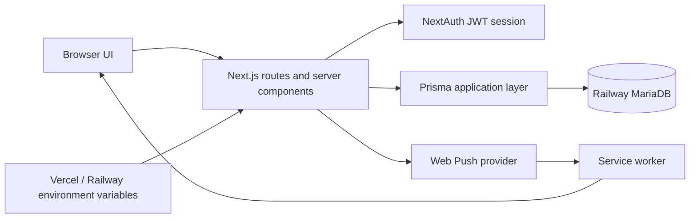

# TaskManager Security

**Status:** Living Document  
**Last Updated:** 2026-07-12  
**Last Verified Against Commit:** `69fea16d`  
**Repository Branch:** `main`  
**Audience:** Future maintainers, AI coding assistants, and contributors reviewing security-sensitive changes.  
**Purpose:** Focused reference for how TaskManager protects authentication, user data, ownership boundaries, and collaborative workflows, and for the rules future development must preserve.

## Security Principles

- Enforce authentication and authorisation on the server. Client filtering and hidden controls are usability measures, not protection.
- Require authentication before reading or changing user data.
- Validate ownership, membership, visibility, and delegated participation against database records on every relevant server operation.
- Treat profiles as work contexts, not permission boundaries. A profile identifier alone grants no access.
- Use Groups as the boundary for user discovery and collaboration visibility. Administrators may discover all users.
- Back every restricted UI state with a server route, server component, or server action check.
- Return only the data needed for the workflow and redact user identity where visibility rules require it.
- Keep database credentials, authentication secrets, private Push keys, and Push subscription key material on the server.
- Review this document and relevant tests whenever security-sensitive behavior changes.

## Trust Boundaries

- **Browser/client UI:** Untrusted for identity, ownership, roles, lifecycle state, target URLs, and resource relationships. Validate submitted identifiers and state again on the server.
- **Next.js server routes and server components:** The primary enforcement boundary. They read the session and apply ownership, participant, membership, role, and visibility predicates before data access.
- **Authenticated session:** A signed JWT establishes the claimed email, but most protected operations resolve that email to a current database user before applying permissions. It is not itself proof of resource ownership.
- **Prisma application layer:** Encodes most isolation and integrity checks. Because the database does not supply all physical foreign-key enforcement, correct query scoping and deletion behavior here are security-relevant.
- **Railway MariaDB:** Stores credentials hashes, user data, collaboration records, notifications, activity records, and Push subscriptions. Direct SQL bypasses application validation.
- **Web Push provider:** Receives encrypted Web Push deliveries addressed by stored subscription material. Push delivery is an optional side effect, never an authorisation mechanism.
- **Service worker:** Handles device-visible Push content and click navigation. It must accept only same-origin destinations.
- **Vercel/Railway environment variables:** Supply database, NextAuth, and VAPID configuration. Public-prefixed values are browser-visible; other secrets must remain server-side.

## Authentication

TaskManager uses NextAuth v4 with a Credentials provider and JWT session strategy. The credentials callback requires an email and password, trims and lowercases the email, finds the unique user by that normalised address, and verifies the submitted password against `passwordHash` with `bcryptjs.compare`. User creation and administrative password reset hash passwords with `bcryptjs.hash` using cost 12.

Successful authentication places the returned user ID, name, and email into NextAuth's normal token/session flow. TaskManager defines no custom JWT or session callback, and the user's database role is not copied into the token or session object. Role-sensitive code re-queries the user record by session email.

The root proxy reads the signed token with `NEXTAUTH_SECRET`. It permits the login page, NextAuth routes, Next.js assets, the manifest, and public files; otherwise it redirects a missing token to `/login` with a same-origin-safe callback URL. Authenticated visits to `/login` redirect away. Server pages generally call `getServerSession` and return `notFound()` or redirect when no session email exists. API routes generally return `401`, then resolve the current database user or scope resource queries through the session email.

Confirmed limitations:

- The schema has no active, disabled, deleted, password-expiry, or forced-password-change state. Any stored user with a matching password can authenticate.
- No application-specific session `maxAge`, refresh policy, or revocation/version field is configured. Password resets and role changes do not explicitly invalidate an already issued JWT; server-side database checks still apply current roles and resource ownership where those checks are performed.
- The login path contains no application-level rate limit, lockout, or login-attempt record.
- Global proxy protection is broad, but it is defence in depth rather than a substitute for route-level checks. The timer start and stop inconsistency described below demonstrates why.

## Authorisation Model

### User-owned profile resources

Profiles normally belong to a user through `Profile.userId`. Profile collection and item routes query through the authenticated user's email or user ID. Tasks, projects, time entries, and Sunday Check-ins derive access through that owned parent profile; item routes normally combine the submitted resource ID with the owned profile or profile relation. Server-rendered profile and reporting pages perform the same ownership lookup before loading profile data.

Routine Support and Sunday Check-ins remain profile-owned. The check-in route requires a session and resolves a routine-enabled profile owned by the session user. Its Sunday-only timing rule is workflow validation, not an ownership boundary.

Profiles are not identities and are not collaboration permissions. Possessing or selecting another profile ID must never grant access. Nullable legacy `Profile.userId` and `Task.profileId` values exist for historical and delegated records, so new code must not assume every task has an owned profile.

Most profile routes and manual timesheet routes correctly scope records to the session user. **Current inconsistencies:** the profile reorder handler does not read a session or owner and instead validates, updates, and returns the complete profile table; timer start does not read a session and accepts any existing profile ID; and timer stop does not read a session or profile owner and stops the newest globally active timer. The proxy normally requires some valid JWT for these paths, but these handlers do not prevent one authenticated user from reading or changing another user's profile ordering/timer state. Treat these operations as known gaps, not implemented ownership guarantees.

### Delegated Tasks

Delegation is an explicit exception to ordinary profile ownership. A delegated record names an original delegator and an assignee; both foreign keys are nullable so historical records survive user deletion. Creation validates that the source task belongs to the delegator (when wrapping an existing task), that the recipient is not the actor, and that the recipient is visible under Group rules. Delegated list pages query by the current user's participant ID.

| Action | Required participant | Allowed current state | Result |
|---|---|---|---|
| Accept | Assignee | `PENDING` | `ACCEPTED` |
| Decline | Assignee | `PENDING` | `DECLINED` |
| Start work | Assignee | `ACCEPTED` | `IN_PROGRESS` |
| Mark complete | Assignee | `IN_PROGRESS` | `COMPLETED` |
| Close | Original delegator | `COMPLETED` | `CLOSED` |
| Add note | Delegator or assignee | Any recorded state | No lifecycle change |

Lifecycle routes check both participant identity and current state. State-changing updates repeat those conditions in `updateMany` predicates to reject races or stale requests. Both participants can add notes. Notifications go to the other participant for receipt, responses, notes, completion, and close events; a nullable historical recipient suppresses notification creation rather than inventing a recipient.

On acceptance, the assignee may select one of their own profiles. If the source task belongs to another user's profile, the route creates an assignee-owned task copy and transfers the delegated wrapper to it; copied note history retains nullable historical authors. This differs from the older Playbook statement that delegation never moves task origin and should be reviewed as a documentation/model consistency issue.

### Groups and User Visibility

Groups bound user discovery, not profile ownership. A standard user can see themselves and users sharing at least one Group. A standard user with no Groups sees only themselves. An administrator can see all existing users.

Both `/api/users` and the delegated-user picker use the shared server-side visibility predicate and return only IDs, names, and emails; the delegated picker excludes the actor. Delegation receiver validation repeats `canSeeUser` on submission. Collaborative Space member addition and user-valued cell assignment also validate visibility server-side. Client-side picker filtering alone is never sufficient.

Space member lists and matrix note authors are filtered through the requesting user's Group visibility. Hidden note authors are returned with a neutral placeholder rather than their ID, name, or email. Consequently, Collaborative Space membership does not automatically make every member discoverable to every other member.

### Collaborative Spaces

“Collaborative Spaces” is the formal subsystem name; “Spaces” is the UI shorthand. Space listing and detail reads require membership. Creating a Space makes the actor an `owner`.

Owners can add members or owners, remove members, and permanently delete the Space. Owners may add only users they are allowed to discover. Removing the only owner is blocked. Member-list reads also apply Group visibility.

All members—not only owners—can create, rename, reorder, complete, or delete rows; create, rename, reorder, archive, restore, or permanently delete columns; manage status options; edit cells and assignments; and add cell notes. Row, column, option, and cell routes verify membership and also verify that submitted child IDs belong to the named Space (and, where applicable, the named column). User assignments must be visible, and the special card-assignee input must identify a Space member.

Permanent column deletion is allowed to any member only when no cell in the column contains meaningful saved data or note history; otherwise the route requires clearing/moving data or archiving. Row deletion is also a member action and cascades its cells. Space deletion and membership administration are the owner-only destructive controls. Future UI changes must preserve these actual server distinctions rather than implying all destructive actions are owner-only.

### Administrative and Restricted Features

The only general roles in the schema and code are `user` and `admin`. Admin-only server actions manage users, password resets, Groups, Group membership, and roles. Admin-only reporting can read activity and routine-support data across users. The Activity page shows standard users only their own logs and allows administrators to query all users.

Lost/Hatch is a separate owner-restricted feature. Its server page checks the authenticated email against a hard-coded allowlist and returns not found otherwise; UI hiding is additional convenience. The private owner identity must not be copied into documentation or logs.

## Data Access and Isolation

TaskManager uses distinct concepts that must not be conflated:

- **Ownership:** A user owns profiles; profiles own normal tasks, projects, time entries, and Sunday Check-ins. Queries must traverse that ownership relationship.
- **Membership:** A Space member can read and mutate shared matrix content; an owner additionally manages membership and Space deletion.
- **Visibility:** Groups decide which user identities can appear in discovery, pickers, assignments, member lists, and note attribution. Visibility does not grant access to the visible user's profiles.
- **Participation:** Delegator and assignee access the shared delegated workflow and notes, subject to lifecycle-specific actions.
- **Administrative access:** Admin checks enable user/Group administration and cross-user activity reporting. Admin status does not appear as a general bypass in profile-owned resource routes.

Notification records belong to `recipientUserId`. Listing, cursor validation, unread count, read, clear, read-all, and clear-all operations all include the authenticated recipient ID. Notification preferences and the global Push-enabled flag are read and written only for the current user. Activity reports are either scoped to the current user's log rows or explicitly admin-only for cross-user data.

## Notifications and Browser Push Security

- Notification rows belong to recipients. Every notification read or mutation path scopes by `recipientUserId`, including cursor validation.
- Notification preferences belong to the authenticated user; request data cannot select a different preference owner.
- Push subscriptions are listed, created, and deleted in the authenticated user's scope. API responses expose subscription hashes and device metadata, not full endpoints or subscription keys.
- `VAPID_PRIVATE_KEY` stays in server delivery code. Only `NEXT_PUBLIC_VAPID_PUBLIC_KEY` is intentionally exposed to browser code.
- Delivery logs use subscription IDs and endpoint hashes rather than full endpoints, `p256dh`, or `auth` values. Preserve this rule.
- Notification creation rejects blank recipient IDs, event keys, titles, and targets. Targets must begin with one `/` and not `//`. Push payload construction independently converts external targets to `/`.
- The service worker resolves click targets against its own origin and falls back to `/` for external or malformed values.
- Notification titles and bodies can appear on device lock screens. Do not put secrets or unnecessarily sensitive task detail in Push text.
- Push delivery is best-effort, preference-controlled, and failure-isolated. It does not grant access and must not affect domain authorisation.

See [Push Notifications](./PUSH_NOTIFICATIONS.md) for delivery behavior, browser support, troubleshooting, and testing detail.

## Database Integrity and `relationMode = "prisma"`

TaskManager uses Prisma with the MySQL provider through the MariaDB adapter, backed by Railway MariaDB. The schema sets `relationMode = "prisma"`. The committed migrations create indexes and application relationships but do not create physical foreign-key constraints for those modeled relations.

Prisma can emulate supported relation behavior when writes go through Prisma, but MariaDB itself cannot prevent every orphan or inconsistent cross-table reference. Application routes therefore validate parent ownership, Space membership, child-to-parent relationships, participants, and deletion order. Direct SQL, maintenance scripts, or incomplete application transactions can bypass those protections.

Direct production database changes require exceptional care. Migration-first rules remain mandatory, and integrity must not be inferred solely from relations visible in `schema.prisma`. Review nullable historical relations and application-level cascade/set-null expectations whenever deleting users or parent records. Follow [Prisma Migration Workflow](./PRISMA_MIGRATION_WORKFLOW.md) and consult [Migration History](./MIGRATION_HISTORY.md).

## Secrets and Environment Configuration

Verified configuration categories from `.env.example` and current code are:

| Variable | Exposure | Purpose |
|---|---|---|
| `DATABASE_URL` | Server-only secret | MariaDB connection string and credentials |
| `NEXTAUTH_SECRET` | Server-only secret | Signs/verifies NextAuth tokens |
| `VAPID_PRIVATE_KEY` | Server-only secret | Signs Web Push requests |
| `NEXT_PUBLIC_VAPID_PUBLIC_KEY` | Public by design | Browser subscription application-server key |
| `VAPID_SUBJECT` | Server configuration, not a private key | VAPID contact URI |
| `NEXTAUTH_URL` | Server configuration used when resolving login callbacks | Application base URL when configured |

Do not commit real values. Do not print database URLs, passwords, authentication secrets, private VAPID keys, full Push endpoints, or Push subscription keys. Review local and hosted Vercel/Railway configuration separately: presence in one environment does not prove correctness in another.

## Input Validation and Safe Routing

Validation is distributed across routes and shared helpers rather than one universal schema framework. Confirmed patterns include trimming and requiring strings; parsing booleans, dates, times, enum-like values, and non-negative orders; checking resource IDs against an owned or member-accessible parent; validating delegation recipients and lifecycle transitions; validating notification recipients and internal targets; and validating Push subscription object shape, key lengths, endpoint URL syntax, and HTTP(S) protocol.

Internal notification targets accept path strings beginning with `/` but not `//`; Push construction and the service worker add same-origin checks. Authentication callback URLs are also constrained to the application origin and exclude login/Auth routes.

Because validation is route-local, new or duplicated endpoints can omit checks. The profile-reorder and timer-handler gaps, together with repeated current-user/ownership code, make consistency review essential.

## Logging and Privacy

TaskManager has two different logging mechanisms:

- **Activity logs** are database records used by users and administrators. They store actor IDs, human-readable descriptions, resource IDs, and selected metadata for task, project, profile, time-entry, and Space events. Standard users see only their own rows; administrators can see cross-user rows and reports.
- **Operational logs** use `console.error`, `console.warn`, and Push `console.info`. Delegated-work errors commonly include task/delegated IDs and participant user IDs. Push logs include recipient IDs, event keys, subscription IDs, endpoint hashes, counts, status codes, and error messages, but not full endpoints or Push keys.

Operational identifiers and activity descriptions can still be personal or reveal task/Space names. Error objects from Prisma, Web Push, or service-worker registration may contain more detail than the explicit log fields. Review production log access, retention, and error serialization before expanding logging. Notification bodies and activity descriptions should contain only the detail needed for their user-facing purpose.

Repository maintenance scripts deserve separate handling: the admin-user bootstrap script prints a temporary password and identity to its invoking terminal. It is not application runtime logging, but operators must treat its output as sensitive and avoid retaining it in shared logs.

## Security Invariants

- [ ] Never trust client-side visibility as authorisation.
- [ ] Never return another user's profile-owned data without an explicit collaboration rule.
- [ ] Always authenticate in each data-bearing server route or action; do not rely only on the proxy.
- [ ] User discovery and identity attribution must respect Group visibility.
- [ ] Delegated actions must validate the participant and allowed lifecycle transition server-side.
- [ ] Collaborative Space actions must validate membership and any required owner role; child resources must belong to that Space.
- [ ] Notification reads and mutations must scope by recipient.
- [ ] Notification preference and Push subscription mutations must scope by the authenticated user.
- [ ] Restricted features must remain protected by server-side checks.
- [ ] Secrets, private VAPID keys, full Push endpoints, and subscription keys must remain server-only and out of logs.
- [ ] Internal navigation targets from notifications and Push must remain same-origin paths.
- [ ] Database schema changes must follow the migration workflow; do not assume `relationMode = "prisma"` provides database foreign keys.
- [ ] Security-sensitive changes require direct API/route testing, documentation review, and review of relevant automated coverage.

## Known Security Debt and Review Areas

| Current state | Practical risk | Review trigger |
|---|---|---|
| The profile reorder handler omits session and ownership checks and operates on every profile in the database. | An authenticated user can enumerate basic profile metadata and reorder profiles belonging to other users. | Before profile-ordering work, multi-user rollout expansion, or a security release. |
| Timer start/stop handlers omit session and ownership checks; start accepts an arbitrary profile and stop finds the latest active timer globally. | An authenticated user can affect another user's timer despite proxy authentication. | Before any timer work, multi-user rollout expansion, or security release. |
| Authentication, current-user resolution, ownership checks, and participant checks are repeated across many files; only some domains use shared helpers. | A new route can diverge or omit a predicate, as the timer routes demonstrate. | When adding routes or touching a domain with duplicated guards; centralise only where it preserves clear domain rules. |
| Lost/Hatch access uses a hard-coded private owner identity in application code. | Identity changes require a code change, and accidental disclosure is easier than with role/config-based policy. | When ownership changes, the feature expands, or access needs more than one stable owner. |
| Automated tests currently cover Push helpers/delivery and recurrence, but not route-level authentication, wrong-user ownership, Groups, delegated lifecycle permissions, Space roles, notifications, or admin actions. | Authorisation regressions may reach production unless caught manually. | Before expanding multi-user or collaborative behavior and whenever security-sensitive routes change. |
| `relationMode = "prisma"` is not backed by automated orphan/integrity checks. | Direct SQL or incomplete application behavior can leave orphaned or inconsistent records. | Before/after data repair, user deletion, relation changes, or production maintenance. |
| JWT sessions have no application revocation/version mechanism, and password reset does not explicitly revoke existing tokens. | A previously issued token may remain usable until normal NextAuth expiry, although current database role/ownership checks still apply. | When account disablement, credential compromise response, or self-service password management is introduced. |
| Credentials login has no application rate limiting, lockout, or attempt audit. | Repeated password guessing is not constrained by this repository's application code. | Before broader internet exposure or if authentication abuse appears in hosting logs. |
| Mutation routes rely on NextAuth cookie behavior and route-specific method handling; no repository-wide explicit Origin/CSRF helper is present for custom JSON APIs. | CSRF posture can become inconsistent as new mutation styles or clients are added. This is a review area, not a confirmed exploit. | When adding cross-origin use, public APIs, native clients, or nonstandard cookie/session settings. |
| `next.config.ts` defines no application-specific security headers. | Browser hardening depends on framework/hosting defaults; requirements have not been recorded or tested here. | Before public sharing, file uploads, third-party scripts, or a wider threat model. |
| Accounts are admin-created/reset; there is no inactive/deleted state, self-service password change/recovery, forced rotation, or temporary-password workflow in the app. | Account lifecycle and offboarding depend on administrative/database practice. | When the user base or account administration model expands. |
| Push subscriptions support multiple devices and remove provider-expired subscriptions, but have no user-set device labels, explicit retention window, or remote “remove all devices” control. | Old but still-valid device subscriptions may remain until removed manually/browser-side or rejected by the provider. | When device churn, offboarding, or shared-device use becomes material. |
| Push bodies can include task titles, actor names, and decline reasons. | Sensitive work context may appear on a locked or shared device. | When adding notification types or handling more sensitive task content. |
| Operational errors include internal IDs and sometimes raw error objects; activity logs include resource names and administrators can view cross-user activity. | Logs may expose personal or work-context data to operators beyond the immediate workflow. | When changing logging, retention, observability providers, or administrator scope. |
| Delegated acceptance may copy a task into the assignee's profile and move the delegated wrapper, while the Playbook says task origin should not move. | Maintainers may apply the wrong ownership assumption to future delegated reads or mutations. | Before changing acceptance, task-copy behavior, or delegated data retention. |

## Security Review Triggers

Review this document and affected checks when introducing or changing:

- user roles, account lifecycle, authentication, session callbacks, or password management;
- collaboration models, Space roles, membership behavior, or public sharing;
- user search, picker, identity attribution, or Group rules;
- delegated lifecycle actions, participant rules, task-copy behavior, or notification recipients;
- notification types, Push payloads, subscription/device management, or service-worker routing;
- external integrations, webhooks, mobile/native clients, or cross-origin APIs;
- schema ownership, nullable relations, deletion behavior, migrations, or direct data repair;
- administrative or owner-restricted features;
- file uploads or user-supplied rich content;
- significant operational/activity logging or observability changes.

## Security Verification Checklist

- [ ] Attempt the page and direct API call with no session.
- [ ] Attempt reads and mutations as a different authenticated user with guessed IDs.
- [ ] Verify standard-user discovery for same Group, different Group, and no Group; compare administrator behavior.
- [ ] Exercise every delegated action as delegator, assignee, and unrelated user, including invalid/stale states.
- [ ] Exercise Space reads and mutations as owner, member, and non-member; verify owner-only membership and Space deletion.
- [ ] Test direct HTTP requests, not only hidden or disabled UI controls.
- [ ] Verify notification list, cursor, read, clear, and bulk operations cannot target another recipient.
- [ ] Verify Push subscription list, create/reassignment, and delete remain scoped to the current user and never return secret material.
- [ ] Request restricted features directly and verify the server rejects an unpermitted session.
- [ ] Review operational and activity logs for secrets, full Push material, unnecessary identity data, and sensitive payload text.
- [ ] Review migrations, parent/child validation, deletion behavior, and multi-user isolation, especially under `relationMode = "prisma"`.

This checklist supplements focused feature tests; it does not replace the future full testing strategy.

## Related Documents

- [Architecture](./ARCHITECTURE.md)
- [Testing and Verification](./TESTING.md)
- [Architecture Decisions](./DECISIONS.md)
- [Project Playbook](../PROJECT_PLAYBOOK.md)
- [AI Quick Start](../HOW_TO_WORK_WITH_TASKMANAGER.md)
- [Push Notifications](./PUSH_NOTIFICATIONS.md)
- [Prisma Migration Workflow](./PRISMA_MIGRATION_WORKFLOW.md)
- [Migration History](./MIGRATION_HISTORY.md)
- [Operations Manual](./OPERATIONS_MANUAL.md)
